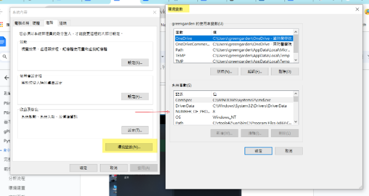
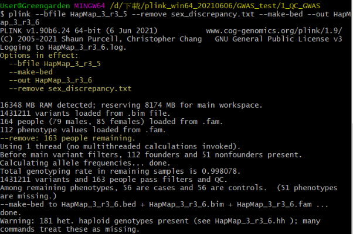
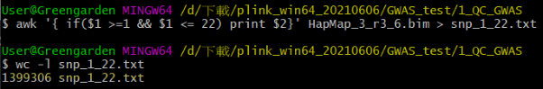
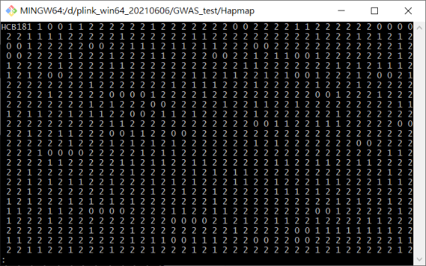
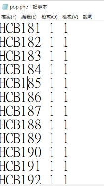
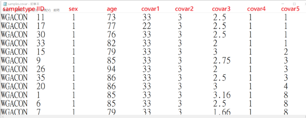
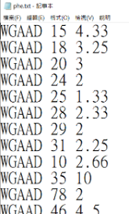
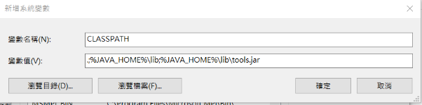

# Plink介紹

談起Plink相信熟悉的人更定都會知道，**這是一個全面的基因組分析工具集**，具有很多的小功能，在SNP數據統計，過濾，GWAS分析中都可以用得上，而且速度非常的快，堪稱是生物信息分析軟件中神器之一。

PLINK是一個**免費的開源全基因組關聯分析工具集**，旨在以計算有效的方式執行一系列基本的大規模分析，由Shaun Purcell在馬薩諸塞州綜合醫院（MGH）的人類基因研究中心（CHGR）和哈佛大學和麻省理工學院的Broad研究所共同開發的。它最初是爲人類數據，但**新的PLINK 1.9以上的版本**也可用於**非模式生物的基因組數據**。

其功能非常強大，**簡單列舉一下相對應的功能**：
1. **數據管理**： SNP數據格式的轉換，合併兩個或多個文件，提取SNP子集，以二進制文件格式壓縮數據等。
2. **質量控制的SNP數據統計**： 計算丟失基因型率，等位基因，基因型頻率，HWE測試，個體和個體對的近親繁殖，IBS和IBD統計，LD區域計算等。
3. **GWAS關聯分析**
4. **Meta分析**
# Plink指令dictionary

[PLINK：全基因組資料分析工具集](https://zzz.bwh.harvard.edu/plink/reference.shtml)

# gPlink-界面化plink分析平台

教學 ：[通用連結](https://zzz.bwh.harvard.edu/plink/gplink.shtml)


gPLINK 是一個 自由地-可用的，基於Java 軟體包： 是一個圖形使用者介面允許建構許多常見的 PLINK 操作 提供簡單的專案管理工具和分析日誌 允許資料和計算位於單獨的伺服器上（透過 SSH） 促進與 Haploview 的集成

**下載並安裝** \
您首先需要在電腦上安裝最新版本的 Java、PLINK 和 Haploview。 \
***請遵循以下所有 4 個步驟***：

1. 您需要在電腦上安裝 Java 1.5：可以從 Sun 網站免費取得適用於所有常見平台的 Java 1.5。下載Java[，點擊此連結](http://www.java.com/en/download/index.jsp)and select Download Now. (安裝java)

2. 你需要PLINK**版本0.99p** 或更高版本以與 gPLINK 一起使用，這可以是[從這裡下載。](https://zzz.bwh.harvard.edu/plink/download.shtml) (下載最新版plink)

3. 支援 gPLINK 的 Haploview 測試版可以從以下位置取得 [這一頁](http://www.broad.mit.edu/mpg/haploview/beta.php)

4. 完成以上三步驟後，點選下載最新的gPLINK（版本2.050） [這裡是 JAR 文件](https://zzz.bwh.harvard.edu/plink/dist/gPLINK-2.050.zip)(as a zipped archive). (下載最新版gPlink，並解壓縮為gPLINK。罐）

如果您下載此文件，請參閱 [GPL v2 授權。](https://zzz.bwh.harvard.edu/plink/gplic.txt) 原始碼可根據要求提供，並將很快發布。

如果您已下載 ZIP 文件，則必須先解壓縮內容（單一 JAR 檔案）。 \
在 Windows 中，雙擊 gPLINK.jar 檔案應該可以運作 \
如果沒有（以及在所有其他平台上），請在命令列提示符號下鍵入

```java
java -jar gPLINK.jar
```

界面化的操作

# Python中執行plink

[https://docs.python.org/zh-tw/3/library/subprocess.html](https://docs.python.org/zh-tw/3/library/subprocess.html)

# R中執行plink

## 環境建立


 \
[PLINK 1.9](https://www.cog-genomics.org/plink/) 下載對應的plink檔案，建議還是安裝plink1.9版plink2.0版很多指令都不一樣


用windows查詢，找到編輯系統環境變數




将R中的bin路径放进去 C:\Program Files\R\R-[版本號碼]\bin\x64

打開Rstudio，新建一個R語法檔案：

system("plink")


## 語法撰寫技巧

```
shell <- ifelse(Sys.info()['sysname'] == "Windows", "cmd", "sh")   ##do LD r2
 plink_bin="你plink.exe檔案路徑位置"
 fun2 <- paste0(
    shQuote(plink_bin, type=shell),
    " --bfile ", shQuote(bfile, type=shell),
    " --extract ", shQuote(fn, type=shell),
    " --r2 ",
    " --keep-allele-order ",
    " --out ", shQuote(fn, type=shell)
  )
```
# 建立R project準備執行plink


設定成功後的畫面

# Git for windows and plink

## 下載與安裝


## 設定plink在git bash的環境變數

注意路徑位置要用"/"而非"\"，注意若工作路徑有空格要用"\_"替代，如:
```
#到plink.exe檔案路徑 #因為我們剛才已經將plink2.exe(或plink.exe)放到R語言路徑下，所以轉向到這個資料夾
cd /c/Program\ Files/R/R-4.3.1/bin/x64  #產生環境變數檔案
mkdir ~/bin
#將plink2.exe或plink.exe複製到環境變數檔案，下面指令選一個執行就好
cp plink.exe ~/bin/ cp plink2.exe ~/bin/ 
#回到上一層路徑
cd ..
#執行plink或plink2若出現訊息就表示OK，下面指令選一個執行就好
plink plink2  
```
# R studio terminal 環境下執行Git bash


Go to Current Directory就可以到目前的工作路徑下執行

# R script中執行server/terminal linux語法


# [教程]-GWAS分析

參考資料: \
[GWAS資料分析教程](https://dengfei2013.gitee.io/gwas-data-analysis/) \
[GWAS 操作流程1 - 簡書](https://www.jianshu.com/p/db0bd298ee77) \
[https://zhuanlan.zhihu.com/p/125568373](https://zhuanlan.zhihu.com/p/125568373)

## 資料下載

下載檔案解壓縮[1121214 GWA_tutorial(for download).zip](https://drive.google.com/file/d/16Zv_Tsvzpq1FFIAdNVdhZ9AH3UlpRyn9/view?usp=drive_link)


## 分析流程

**1. 品質控制 (Quality control)**

**2. 人口分層**

**3. 關聯分析**

**4. 多基因風險評分（PRS）分析**

## SNP Quality control步驟

1. **snp 缺失**

2. **性別篩選**

3. MAF 頻率篩選

4. **哈代溫伯格平衡測試**

5. **雜合率**

6. **相關性**

7. **人口分層**

GWAS分析時，拿到基因型數據，拿到表現型數據，先做以下幾點：

- 1，查看自己的表型數據，是否有問題

- 2，查看自己的基因型數據，是否有問題

品質控制步驟

| 步驟 | 命令 | 功能 | 閾值和解釋 |
|---|---|---|---|
| 1. SNP缺失及個體缺失 | --geno | 排除了大部分受試者中缺失的SNP。在此步驟中，低基因型的SNP被刪除。 | 建議首先以寬鬆的閾值(0.2; > 20%)過濾SNP和個體，從而過濾掉缺失程度很高的SNP和個體。再使用更嚴格的閾值過濾(0.02)。 |
|  | --mind | 排除基因型缺失率高的個體。在此步驟中，低基因型的個體被移除。 | 注意：在個體移除前應先進行SNP過濾。 |
| 2. 性別差異 | --check-sex | 根據X染色體雜合/純合率檢查資料集中記錄的個體性別與他們自身性別的差異。 | 可以指示樣品混合。如果許多研究物件都存在這種差異，則應仔細檢查資料。男性的X染色體純合度估計值為0.8，女性為0.2。 |
| 3. 最小等位元基因頻率（MAF） | --maf | 僅包括超過MAF閾值的SNP。 | 低MAF的SNP很少見，因此缺乏檢測SNP表型關聯的能力。這些SNP也更容易出現基因分型錯誤。MAF閾值應取決於您的樣本大小，較大的樣本可以使用較低的MAF閾值。對於大樣本（N = 100.000）與中等樣本（N=10000）,通常採用0.01和0.05作為MAF閾值。 |
| 4. 哈迪-溫伯格平衡（HWE） | --hwe | 排除偏離哈代-溫伯格平衡的指標。 | 基因分型錯誤的常見指標也可能表明進化選擇。 對於二元性狀，建議排除：病例中HWE p值<1e-10以及對照組中<1e-6。不大嚴格的病例閾值可避免丟棄在選擇下與疾病相關的SNP。對於數量性狀，推薦HWE p值<1e-6。 |
| 5. 雜合性 |  | 排除雜合率高或低的個體 | 偏差可能表明樣品受到污染，近親繁殖。 建議刪除樣本雜合率均值偏離±3標準差的個體。 |
| 6. 相關性 | --genome | 通過下降（IBD）計算所有樣本對的同一性。 | 使用獨立的SNP（剪枝）進行分析，並將其限制為僅常染色體。 |
|  | --min | 設置閾值，並創建一個關聯性高於所選閾值以上的個體列表。這意味著可以檢測到如pihat>0.2的有親屬關係的受試者（即二度親屬）。 | 隱性關聯會干擾關聯分析。如果你有一個以家庭為基礎的樣本（例如：父母-後代），則不需要刪除相關對，但統計分析應考慮到家庭的相關性。然而，對於基於人群的樣本，建議使用pihat閾值為0.2。 |
| 7. 人口分層 | --genome | 通過下降（IBD）計算所有樣品對的同一性。 | 使用獨立的SNP（剪枝）進行分析，並將其限制為僅常染色體。 |
|  | --cluster –mds-plot k | 基於IBS生成資料中任何子結構的k維表示。 | k是需要定義的維數（通常為10）。這是QC的一個重要步驟，它包含多個過程，但為完整起見，此步驟將在“控制人口分層”一節中更詳細地描述。 |

## Plink資料格式

rs1 CT 在plink中的預設allele 1為minor SNP，allele 2為major SNP，所以C為minor allele，T為major allele.[^1] 
Plink常見格式包括：**ped、map、bed、fam、bim**

PLINK接受VCF文件作爲輸入，但在PLINK中使用**的首選格式是**帶有結尾**.ped**（和.map）的文件，以及帶有結尾**.bed（+ .bim + .fam）**的**較小二進制PLINK文件，**這樣處理起來**速度會更加快**。

一般我們call完SNP給出的文件都是vcf文件，這裏需要使用vcftool或者Plink先進行格式的轉換：


使用vcftools來轉換：

```
#vcf轉ped和map #my.vcf:欲被轉換格式的檔案名稱  vcftools --vcf my.vcf --plink --out plink
```
使用plink來轉換：

```
# vcf轉ped和map
plink --vcf file.vcf --recode --out file
```
### **ped格式文件**

ped文件包含每列有一個等位基因的變體信息（意味着一個變體的兩個等位基因需要2列）。

看看其中一個例子：

```
less -S data.noIND04.miss0.5.noMT.thin10.ped
```


每個樣本有一行，前六列爲：


1. **FID**： Family ID表示家族，同一個家族用同一個family ID表示

2. **IID**： Individual ID用來表示個體，family ID和Individual ID連起來唯一表示一個樣本。

3. **PID**： Paternal ID表示父本ID（如果缺少該信息則爲'0'）

4. **MID**： Maternal ID表示父本ID（如果缺少該信息則爲'0'）

5. **Sex**： 性別代碼（'1'=男性，'2'=女性，'0'=未知）

6. **P**： Phenotype（表型)，Plink會自己判斷表型的類型，如果缺少該表型數據，可以使用-9/0/非數字來表示。

7. 第7列第8列： 分別爲第一個變體，第二個變體等的等位基因。缺失的數據被編碼爲0（或-9）。 \
對於上面的例子，由於都沒有關於父本，母本，性別或表型的信息，因此這些列都設置爲缺失數據（0或-9）。

### **map格式文件**

map格式文件包含變體位置，用來記錄每個maker（一般爲SNP）的位置信息。每行一個maker。它有4列：

```
less -S data.noIND04.miss0.5.noMT.thin10.map
```


1. Chr: 染色體名稱

2. SNP: SNP的表示符/ID

3. GD：基因摩爾根距離，不知道就寫0

4. BPP：marker在染色體上的座標位置

常染色體(somatic chromosomes)應編碼爲1至22。以下其他染色體用於指定其他染色體類型。右邊的數字代表PLINK對這些染色體的內部數字編碼：這些將出現在所有輸出而不是原始染色體編碼中。

### **bed格式，fam格式和bim格式文件**

map文件可以進一步轉換成二進制文件（* .bed）。將家族信息，表型信息存儲在單獨的文件（* .fam）中並創建擴展的MAP文件（* .bim）（其中包含有關等位基因名稱的信息，否則將丟失在BED文件中）

文件轉化方法：

```
plink --file mydata --make-bed
```

 \
**bed格式**

該格式的文件主要包含了**基因型的雙等位基因變異**。**必須附帶.bim和.fam文件**。用--bfile加載;可以使用--make-bed命令生成。注意的是該格式和我們平時接觸含有基因組位置的bed格式文件不同。在基因型信息中，每一行是一個個體，每一列就是一個變異。**其中0、1、2分別對應了aa、Aa或aA和AA。**不考慮鹼基型，因爲我們不關注ATGC的變化。

**fam格式**

該格式文件是**bed格式文件附屬的基因型的樣本信息文件**，**每一行就是一個樣本**。

**bim格式**

該格式文件是bed格式文件附屬的基因型擴展信息的文件**，每一行是一個變異**，及其註釋信息。

## Step1-SNP缺失資料處理

[笔记| GWAS 操作流程2-1：缺失质控](https://zhuanlan.zhihu.com/p/126178268) \
video: \
[https://www.bilibili.com/video/BV1pZ4y1s7rR/?spm_id_from=trigger_reload](https://www.bilibili.com/video/BV1pZ4y1s7rR/?spm_id_from=trigger_reload)

資料清洗佔用了80%的時間，正如一句俗話所說：“垃圾進，垃圾出”，因此資料清洗非常重要。今天我們將學習如何清洗基因組資料。 \
為什麼要對缺失數據進行篩選呢？

如果一個個體的50萬個SNP數據中有20%（即10萬個）缺失，那麼我們認為這個個體的質量不合格，如果將其納入分析，可能會對結果產生負面影響，因此我們可以將其刪除。 \
如果某個SNP在500個樣本中缺失率為20%（即在100個個體中都沒有基因型數據），我們也可以認為該SNP質量較差，應予以刪除。當然，這裡的20%是質控標準，可以根據需要調整。在下文中，我們將使用2%的質控標準。

因為資料是以plink的bfile格式存儲的，二進制格式不便於查看，所以我們將其轉換為文本格式的map和ped檔案。

### **1. plink數據格式轉換**

將二進位的HapMap_3_r3_1.bed、HapMap_3_r3_1.bim、HapMap_3_r3_1.map檔案轉為test.map及test.ped檔，這樣才能查看資料，因為二進位檔人類無法看懂

```
plink --bfile HapMap_3_r3_1 --recode --out test
```


结果生成：test.map test.ped，如下所示


### **2. 查看基因型個體和SNP数量**

```
wc -l test.map test.ped
```

預覽一下ped文件，跳出畫面輸入 "q”

```
#顯示前筆資料
less -S test.ped
```


預覽一下map文件

```
#顯示前筆資料
less -S test.map
```


### **3. 查看一下個體缺失的位點數，每個SNP缺失的個體數**

```
#將檔名為test.map及test.ped的檔案，查看其資料missing狀況 plink --file test --missing #可以用二進位檔案來查看 plink --bfile HapMap_3_r3_1 --missing
```

會產生兩個缺失檔案

结果有兩個文件，分别是個體ID上SNP缺失的信息，另一個是每個SNP在個體ID中缺失的信息。

- 個體缺失位點的統計在plink.imiss中

- 單個SNP缺失的個體數在plink.lmiss.中


```
#顯示前筆資料，不看資料了要按q退出 less -S plink.imiss  #個體缺失位點統計預覽：" 第一欄(FID)為家系ID，第二欄(IID)為個體ID，第三欄(MISS_PHENO)是否表型缺失，第四欄(N_MISS)缺失的SNP個數，第五欄N_GENO)總SNP個數，第六欄(F_MISS=N_MISS/N_GENO)缺失率。 
less -S plink.lmiss  #SNP缺失的個體數文件預覽：" 第一欄(CHR)為染色體，第二欄(SNP)為SNP名稱，第三欄(N_MISS)為缺失個數，第四欄(N_GENO)為總個數，第五欄(F_MISS)為缺失率。 
```
用R繪製SNP及個體數據缺失圖並存為pdf檔

```
indmiss=read.table(file="plink.imiss", header=TRUE)
snpmiss=read.table(file="plink.lmiss", header=TRUE)
# read data into R 

pdf("histimiss.pdf") #indicates pdf format and gives title to file
hist(indmiss[,6],main="Histogram individual missingness") #selects column 6, names header of file
dev.off() # shuts down the current device 
pdf("histlmiss.pdf") 
hist(snpmiss[,5],main="Histogram SNP missingness")   dev.off() # shuts down the current device 
```
```
#因為教程已經有將這段語法寫成hist_miss.R也可以直接執行 
source("hist_miss.R") 
```
「基因型個體缺失率统计：」

也可以在Git bash直接執行Rscript，先設定環境


從Rstudio ->Tools->Shell 打開git bash

```
#設定檔案位置路徑 cd /d/greengarden/GWA_tutorial/1_QC_GWAS #執行hist_miss.R的Rscript Rscript hist_miss.R
```


### **4. 對個體及SNP缺失率進行篩選。**

1. **[以SNP為單位]**如果一个SNP在個體中2%都是缺失的，那么就删掉该SNP，参数为：--geno 0.02

2. **[以樣本個體為單位]**如果一个個體，有2%的SNP都是缺失的，那么就删掉该個體，参数为：--mind 0.02

```
#先過濾 SNP 缺失率高於 2% 的 SNP plink --bfile HapMap_3_r3_1 --geno 0.02 --make-bed --out HapMap_3_r3_2
```


```
#轉換為 map 和 ped 格式，方便查看內容 plink --bfile HapMap_3_r3_2 --recode --out test
```


查看一下过滤后的行数，

「之前的为：」

```
1457897 test.map
    165 test.ped
```
「现在的为：」

```
1430443 test.map
    165 test.ped
```
可以看出，过滤了2万多个位点。

从当时的log日志里也可以看出这一点：

```
PLINK v1.90b6.5 64-bit (13 Sep 2018)           www.cog-genomics.org/plink/1.9/
(C) 2005-2018 Shaun Purcell, Christopher Chang   GNU General Public License v3
Logging to HapMap_3_r3_2.log.
Options in effect:
  --bfile HapMap_3_r3_1
  --geno 0.02
  --make-bed
  --out HapMap_3_r3_2

515185 MB RAM detected; reserving 257592 MB for main workspace.
1457897 variants loaded from .bim file.
165 people (80 males, 85 females) loaded from .fam.
112 phenotype values loaded from .fam.
Using 1 thread (no multithreaded calculations invoked).
Before main variant filters, 112 founders and 53 nonfounders present.
Calculating allele frequencies... done.
Warning: 225 het. haploid genotypes present (see HapMap_3_r3_2.hh ); many
commands treat these as missing.
Total genotyping rate is 0.997378.
27454 variants removed due to missing genotype data (--geno).
1430443 variants and 165 people pass filters and QC.
Among remaining phenotypes, 56 are cases and 56 are controls.  (53 phenotypes
are missing.)
--make-bed to HapMap_3_r3_2.bed + HapMap_3_r3_2.bim + HapMap_3_r3_2.fam ...
done.
可以看到--geno，过滤了27454个位点。
```
```
#再過濾個體缺失率高於 2% 的個體 plink --bfile HapMap_3_r3_2 --mind 0.02 --make-bed --out HapMap_3_r3_3
```
查看log 沒有個案被移除

```
Options in effect:
  --bfile HapMap_3_r3_2
  --make-bed
  --mind 0.02
  --out HapMap_3_r3_3

515185 MB RAM detected; reserving 257592 MB for main workspace.
1430443 variants loaded from .bim file.
165 people (80 males, 85 females) loaded from .fam.
112 phenotype values loaded from .fam.
0 people removed due to missing genotype data (--mind).
Using 1 thread (no multithreaded calculations invoked).
Before main variant filters, 112 founders and 53 nonfounders present.
Calculating allele frequencies... done.
Warning: 179 het. haploid genotypes present (see HapMap_3_r3_3.hh ); many
commands treat these as missing.
Total genotyping rate is 0.997899.
1430443 variants and 165 people pass filters and QC.
Among remaining phenotypes, 56 are cases and 56 are controls.  (53 phenotypes
are missing.)
--make-bed to HapMap_3_r3_3.bed + HapMap_3_r3_3.bim + HapMap_3_r3_3.fam ...
done.
```
沒有過濾掉個體共165為，SNP為1430443個點位

### **5 同時對個體和SNP的缺失率進行篩選**

可以將--geno –mind指令同時進行

```
plink --bfile HapMap_3_r3_1 --geno 0.02 --mind 0.02 --make-bed --out HapMap_3_r3_5
```


plink日誌：

```
Options in effect:
  --bfile HapMap_3_r3_1
  --geno 0.02
  --make-bed
  --mind 0.02
  --out HapMap_3_r3_5

515185 MB RAM detected; reserving 257592 MB for main workspace.
1457897 variants loaded from .bim file.
165 people (80 males, 85 females) loaded from .fam.
112 phenotype values loaded from .fam.
1 person removed due to missing genotype data (--mind).
ID written to HapMap_3_r3_5.irem .
Using 1 thread (no multithreaded calculations invoked).
Before main variant filters, 112 founders and 52 nonfounders present.
Calculating allele frequencies... done.
Warning: 225 het. haploid genotypes present (see HapMap_3_r3_5.hh ); many
commands treat these as missing.
Total genotyping rate in remaining samples is 0.997486.
26686 variants removed due to missing genotype data (--geno).
1431211 variants and 164 people pass filters and QC.
Among remaining phenotypes, 56 are cases and 56 are controls.  (52 phenotypes
are missing.)
--make-bed to HapMap_3_r3_5.bed + HapMap_3_r3_5.bim + HapMap_3_r3_5.fam ...
done.
```
## Step2-性別質控

[https://www.bilibili.com/video/BV1nZ4y1K7KX?spm_id_from=333.999.0.0](https://www.bilibili.com/video/BV1nZ4y1K7KX?spm_id_from=333.999.0.0) \
[https://cloud.tencent.com/developer/article/1629759](https://cloud.tencent.com/developer/article/1629759)

❝主要是人類性別的信息的質控，主要是**根據性染色上SNP的比值**，**判斷性別，然後把性別錯誤的個體去掉或者更改性別信息**。**對其它物種參考意義不大**，因為在動物中一般把性別信息的SNP去掉，植物中一般都是雌雄同體的，不涉及到這個問題，之所以會有這一篇，是因為原文中有這個信息，而且plink 也有--check-sex的參數，所以操作一下，留下筆記。 ❞

**「原理：」檢查性別差異。先驗信息，女性的受試者的F值必須小於0.2，男性的受試者的F值必須大於0.8。這個F值是基於X染色體近交（純合子）估計**。不符合這些要求的受試者被PLINK標記為“PROBLEM”。

| 性別 | F值 |
|---|---|
| 女性 | <0.2 |
| 男性 | >0.8 |


### **1. 檢查性別衝突**

```
plink --bfile HapMap_3_r3_5 --check-sex
```


上面黃色為產出的檔案

結果文件：plink.sexcheck第一欄為家系ID，第二欄為個體ID，第三欄為系譜中的性別，第四欄為SNP推斷的性別，第五列是否正常，第六列為F值。

```
less -S plink.sexcheck
```


**「使用R語言作圖：」**

```
gender=read.table("plink.sexcheck",header=T,as.is=T)

pdf("Gender_check.pdf")
hist(gender[,6],main="Gender",xlab="F")
dev.off()

pdf("Men_check.pdf")
male=subset(gender,gender$PEDSEX==1)
hist(male[,6],main="Men",xlab="F")
dev.off()

pdf("Women_check.pdf")
female=subset(gender,gender$PEDSEX==2)
hist(female[,6],main="Women",xlab="F")
dev.off()
```
|  |  |
|---|---|

**圖中可以看出，woman中，大部分都是小於0.2，有一個為1，應該是錯誤的ID。**

### **2. 提取錯誤的ID**

我們使用grep過濾一下：根據STATUS列，**如果有問題的話，為“PROBLEM**”，我們可以根據這個關鍵詞將有問題的行打印出來。

```
grep "PROBLEM" plink.sexcheck
```


1349 NA10854 2 1 PROBLEM 0.99

可以看出，個體NA10854是有問題的。

**將相關錯誤的ID提取出來（家系ID，個體ID），之所以提取家系ID和個體ID**，因為plink有參數remove可以根據ID進行篩選。

| #將plink.sexcheck資料裡還有PROBLEM字眼的列挑出，另存為sex_discrepancy.txt grep 'PROBLEM' plink.sexcheck | awk '{print $1,$2}' > sex_discrepancy.txt | | :---- |


我們將結果保存在sex_discrepancy.txt。 1349是row index

### **3. 使用remove去掉個體**

```
#將名為HapMap_3_r3_5的bfile檔案，移除sex_discrepancy.txt裡的個案，另外產製一個bed檔 名為HapMap_3_r3_6 plink --bfile HapMap_3_r3_5 --remove sex_discrepancy.txt --make-bed --out HapMap_3_r3_6
```



當然，**你也可以對個體進行判定填充**，這是用--impute-sex就可以實現，**這樣的話那個錯誤的個體會根據統計量更改性別信息。這裡我們選擇的是刪掉這個個體。**

```
plink --bfile HapMap_3_r3_5 --impute-sex --make-bed --out HapMap_3_r3_6
```
### **4. 過濾的關鍵詞**

去掉個體或者SNP，關鍵詞不一樣，容易混淆，這裡總結一下。

**「保留或去掉個體：」**

```
--keep < filename >         
--remove < filename >

--keep-fam <filename>         
--remove-fam <filename>
```
**「保留或去掉SNP：」**

```
--extract['range'] <filename>        
--exclude['range'] <filename>
```
## Step3- Minor allele frequency (MAF)過濾

[https://cloud.tencent.com/developer/article/1614202?from=article.detail.1629759](https://cloud.tencent.com/developer/article/1614202?from=article.detail.1629759) \
[https://www.bilibili.com/video/BV1X54y1r7D7?spm_id_from=333.999.0.0](https://www.bilibili.com/video/BV1X54y1r7D7?spm_id_from=333.999.0.0)

上一次我們經過去掉缺失，去掉錯誤的性別信息，得到的文件為：

- HapMap_3_r3_6.bed

- HapMap_3_r3_6.fam

- HapMap_3_r3_6.log

- HapMap_3_r3_6.bim

- HapMap_3_r3_6.hh

這裡，我們根據最小等位基因頻率（MAF）去篩選。

**「為什麼要根據MAF去篩選？」**

❝**最小等位基因頻率**怎麼計算？比如一個位點有AA或者AT或者TT，那麼就可以計算A的基因頻率和T的基因頻率，qA + qT = 1，這裡誰比較小，誰就是最小等位基因頻率，比如qA = 0.3, qT = 0.7， 那麼這個位點的MAF為0.3. 之所以用這個過濾標準，是因為**MAF如果非常小，比如低於0.02，那麼意味著大部分位點都是相同的基因型，這些位點貢獻的信息非常少，增加假陽性**。更有甚者MAF為0，那就是所有位點只有一種基因型，這些位點沒有貢獻信息，放在計算中增加計算量，沒有意義，所以要根據MAF進行過濾。 ❞


 \
**MAF與sample size對應圖** \
Figure 1: Effect of sample size and MAF on power to detect eQTLs.(a) Power for cis-eQTL analysis in which we assume α = 0.05/200,000, reflecting Bonferroni correction for 200,000 hypotheses based on 20,000 genes and an average of 10 non-redundant SNPs in the region ±100 kb of each gene. (b) Power for trans-eQTL analysis in which we test 20,000 genes against 5 million SNPs in a total of 1 × 1011 tests with α = 5 × 10−13. [10.1038/ng.2653](http://dx.doi.org/10.1038/ng.2653)

### **1. 去掉性染色體上的位點**

**「思路：」**

- 在map文件中選擇體染色體(1-22對)，提取snp信息

- 根據snp信息進行提取

**「提取體染色體(somatic chromosomes)上的位點名稱：」**

因為這裡是人的數據，所以染色體只需要取1~22的體染色體，提取它的SNP ID，後面用於提取整個二進位檔資料。

```
#從HapMap_3_r3_6.bim檔案提取第一個欄位($1，也就是染色體號)>=1且<=22的資料，另存2第二欄位資料($2)為snp_1_22.txt awk '{ if($1 >=1 && $1 <= 22) print $2}' HapMap_3_r3_6.bim > snp_1_22.txt
```


體染色體上共有1399,306位點。


### **2. 提取體染色體上的位點**

這裡，用到了位點提取參數--extract

```
#依據snp_1_22.txt SNP ID資訊從HapMap_3_r3_6提取符合的資料另存為HapMap_3_r3_7 plink --bfile HapMap_3_r3_6 --extract snp_1_22.txt --make-bed --out HapMap_3_r3_7
```
可以看到，共有163個基因型，共有1,399,306個SNP


比較簡單的做法是

```
plink --bfile HapMap_3_r3_6 --chr 1-22 --make-bed --out HapMap_3_r3_7
```
### **3. 計算每個SNP位點的基因頻率**

首先，通過參數--freq，**計算每個SNP的MAF頻率**，通過直方圖查看整體分佈。可視化會更加直接。

```
plink --bfile HapMap_3_r3_7 --freq --out MAF_check
```


結果文件：MAF_check.frq預覽：

```
less -S MAF_check.frq
```


**A1**：則是指次要等位基因，通常是相對於 A2 的變異等位基因。 \
**A2**：通常是指主要等位基因，或是在特定分析中被視為“參考”或“常見”等位基因。

### **4. 對SNP頻率作圖**

**「R代碼：」**

```
maf_freq<-read.table("MAF_check.frq",header=TRUE,as.is=T) pdf("MAF_distribution.pdf") hist(maf_freq[,5],main="MAFdistribution",xlab="MAF") dev.off()
```
**「圖形如下：」**


可以看出，很多基因頻率為0，說明沒有分型，這些位點需要刪掉。

### **5. 去掉MAF小於0.05的位點**

```
plink --bfile HapMap_3_r3_7 --maf 0.05 --make-bed --out HapMap_3_r3_8
```
可以看到，325,518個位點被刪掉了，剩餘1,073,788 個位點。

**「結果文件：」**


後面我們用這個文件，進行後續的質控。

## Step 4: 哈溫平衡檢驗

[https://cloud.tencent.com/developer/article/1621523](https://cloud.tencent.com/developer/article/1621523) \
[https://www.bilibili.com/video/BV1ra4y1s7yR?spm_id_from=333.999.0.0](https://www.bilibili.com/video/BV1ra4y1s7yR?spm_id_from=333.999.0.0) \
影片說明:[https://youtu.be/RX3TEyMvUps](https://youtu.be/RX3TEyMvUps)

**「什麼是哈溫平衡？」**

❝哈迪-溫伯格(Hardy-Weinberg)法則哈迪-溫伯格（Hardy-Weinberg）法則是群體遺傳中最重要的原理，它解釋了繁殖如何影響群體的基因和基因型頻率。這個法則是用Hardy,GH (英國數學家) 和Weinberg，W.（德國醫生）兩位學者的姓來命名的，他們於同一年（1908年）各自發現了這一法則。他們提出在一個不發生突變、遷移和選擇的無限大的隨機交配的群體中，基因頻率和基因型頻率將逐代保持不變。---百度百科❞

**「怎麼做哈溫平衡檢驗？」**

❝ **「卡方適合性檢驗！」**，一個群體是否符合這種狀況，即達到了遺傳平衡，也就是一對**等位基因的3種基因型的比例分佈符合公式：p2+2pq+q2=1,p+q=1,(p+q)2=1**.基因型MM的頻率為p2,NN的頻率為q2,MN的頻率為2pq。**MN:MN：NN＝P2：2pq：q2**。MN這對基因在群體中達此狀態，就是達到了遺傳平衡。如果沒有達到這個狀態，就是一個遺傳不平衡的群體。但隨著群體中的隨機交配，將會保持這個基因頻率和基因型分佈比例，而較易達到遺傳平衡狀態。應用Hardy-Weinberg遺傳平衡吻合度檢驗方法，把計算得到的基因頻率代入，計算基因型平衡頻率，再乘以總人數，求得預期值（e）。把觀察數（O）與預期值（e）作比較，進行χ2檢驗。**病例組和對照組的基因型分佈的觀察值和預期值差異無顯著性（P>0.05），符合遺傳平衡定律**. ❞

**「哈溫平衡過濾和MAF過濾的區別？」**

❝之前，我對這兩個概念有點混淆，後來明白過來了。這兩個概念一個是對基因頻率進行的篩選，一個是對基因型頻率進行的篩選。對於一個位點“AA AT TT”，其中A的頻率為基因頻率，AA為基因型頻率。MAF直接是對基因頻率進行篩選，而哈溫平衡檢驗，則是根據基因型推斷出理想的（AA，AT，TT）的分佈，然後和實際觀察的進行適合性檢驗，然後得到P值，根據P值進行篩選。**即P值越小，說明該位點越不符合哈溫平衡**。 ❞

**「兩個目的：」**

- 計算所有位點的哈溫檢測結果

- 刪除SNP中不符合哈溫平衡的位點

### **1. 計算所有位點的HWE的P值**

```
plink --bfile HapMap_3_r3_8 --hardy
```


plink.hwe的數據格式：

- CHR 染色體

- SNP SNP的ID

- TEST 類型

- A1 minor 位點

- A2 major 位點

- GENO 基因型分佈：A1A1, A1A2, A2A2

- O(HET) 觀測雜合度頻率

- E(HET) 期望雜合度頻率

- P 哈溫平衡的卡方檢驗P-value值

結果預覽：


### **2. 提取哈溫p值小於0.0001的位點(不符合哈溫平衡)**

這裡我們使用awk：

```
#篩選第9欄(也就是P) <0.0001的資料，並只列出第0欄也就是所有欄位，另存為plinkzoomhwe.hwe awk '{if($9 < 0.0001) print $0}' plink.hwe > plinkzoomhwe.hwe
```
共有123個位點，其中UNAFF為45個位點。


```
less -S plinkzoomhwe.hwe
```
### **3. 設定過濾標準1e-4**

```
plink --bfile HapMap_3_r3_8 --hwe 1e-4 --make-bed --out HapMap_3_r3_9
```


可以看到，共有**45個SNP根據哈溫的P值過濾掉了**，和上面手動計算的一樣。

### **4. 可視化**

R代碼：

```
hwe<-read.table(file="plink.hwe",header=TRUE)
pdf("histhwe.pdf")
hist(hwe[,9],main="HistogramHWE")
dev.off()

hwe_zoom<-read.table(file="plinkzoomhwe.hwe",header=TRUE)
pdf("histhwe_below_theshold.pdf")
hist(hwe_zoom[,9],main="HistogramHWE:stronglydeviatingSNPsonly")
dev.off()
```
|  |  |
|---|---|
| 哈溫的P值直方圖 | 被過濾的SNP位點其P值直方圖 |

### **過濾後的結果文件**

- HapMap_3_r3_9.bed

- HapMap_3_r3_9.bim

- HapMap_3_r3_9.fam

- HapMap_3_r3_9.log


## Step 5:雜合率(Heterozygosity rate)檢驗

[https://www.bilibili.com/video/BV1o54y1r76a?spm_id_from=333.999.0.0](https://www.bilibili.com/video/BV1o54y1r76a?spm_id_from=333.999.0.0) \
[https://cloud.tencent.com/developer/article/1621521](https://cloud.tencent.com/developer/article/1621521)


### **範例-計算雜合率**

假設我們有一個由10個樣本組成的群體，每個樣本都有一個特定的SNP（單核苷酸多態性）基因型。這些樣本的基因型如下：

- **樣本1**: AA

- **樣本2**: AA

- **樣本3**: AA

- **樣本4**: AA

- **樣本5**: AB

- **樣本6**: AB

- **樣本7**: AB

- **樣本8**: BB

- **樣本9**: BB

- **樣本10**: BB

在這個例子中，我們有：

- Heterozygous (AB) 的樣本數: 3（樣本5、6、7）

- Total samples: 10

雜合率計算如下：


若要符合哈溫平衡: \
A allele frequency=11/20=55% \
B allele frequency=9/20=45%

若符合哈溫平衡雜合率應該 2pq=2*(0.55)*(0.45)=0.495左右

**一般自然群體**，基因型個體的**雜合度過高或者過低，都不正常**，我們需要根據雜合度進行過濾。偏差可能表明**樣品受到污染，近親繁殖**。我們建議**刪除樣品雜合率平均值中偏離±3 SD的個體**。

**「參數過濾和手動過濾」** plink有個特點，所有的過濾標準，都可以生成過濾前的文件，然後可以手動過濾，也可以用參數進行過濾。

- 比如：--missing生成結果，也可以用--geno和--mind過濾。

- 比如：--hardy生成結果，可以使用--hwe過濾

- 比如：--freq生成結果，可以用--maf過濾但是雜合度--het，沒有過濾的函數，只能通過編程去提取ID，然後用--remove去實現。

### **1. 計算雜合度**

```
plink --bfile HapMap_3_r3_9 --het --out R_check
```


結果文件：


```
less -S R_check.het
```


例如以最後一個列IID:NA07031為例，(693763-6.941e+5)/(1071122-6.941e+5)=-0.0009961

欄位說明:

1. FID: 	Family ID   # 家系ID

2. IID: 	Within - family ID # 個體ID

3. O ( HOM 0) 	Observed number of homozygotes # 實際純合個數

4. E ( HOM ) 	Expected number of homozygotes # 期望純合個數

5. N ( NM ) 	Number of non - missing autosomal genotypes # 總個數

6. F 	Method - of - moments F coefficient estimate #所以，雜合度= (N-O)/N

### **2. 雜合度可視化**

R代碼：

```
het <- read.table("R_check.het", head=TRUE)
pdf("heterozygosity.pdf")
het$HET_RATE = (het$"N.NM." - het$"O.HOM.")/het$"N.NM."
hist(het$HET_RATE, xlab="Heterozygosity Rate", ylab="Frequency", main= "Heterozygosity Rate")
dev.off()
```
可視化：


### **3. 計算雜合度三倍標準差以外的個體**

首先，查看哪些個體在3倍標準差以外：

| het <- read.table("R_check.het", head=TRUE) \
het$HET_RATE = (het$"N.NM." - het$"O.HOM.")/het$"N.NM." #篩選出3個標準差以外的資料列 \
het_fail = subset(het, (het$HET_RATE < mean(het$HET_RATE)-3*sd(het$HET_RATE)) | (het$HET_RATE > mean(het$HET_RATE)+3*sd(het$HET_RATE))) \
 #計算每個雜合度數值的變異係數，也就是與平均數值相差幾個標準差 het_fail$HET_DST = (het_fail$HET_RATE-mean(het$HET_RATE))/sd(het$HET_RATE) \
 #輸出不符合條件的個案"FID","IID" out=het_fail[,c("FID","IID")] out write.table(out, "fail-het-qc.txt",              row.names=FALSE,             col.names = F,             quote=F) | | :---- | |  |

### **4. 去掉這些個體ID**

使用remove去掉這兩個個體

```
plink --bfile HapMap_3_r3_9 --remove fail-het-qc.txt --make-bed --out HapMap_3_r3_10
```


### **5. 結果文件**


## Step 6-去除親缘關係近的個體

[https://cloud.tencent.com/developer/article/1627691](https://cloud.tencent.com/developer/article/1627691)

這裡提到移除親子關係的個體是可選的，如果我們分析的群體中有親子關係的個體，並且想要進行分析，則無需執行這一步篩選。

### **1. 计算pihat > 0.2的组合**

```
plink --bfile HapMap_3_r3_10 --genome --min 0.2 --out pihat_min0.2
```


说明文档：

```
--genome invokes an IBS/IBD computation, and then writes a report with the following fields to plink.genome:

FID1	Family ID for first sample
IID1	Individual ID for first sample
FID2	Family ID for second sample
IID2	Individual ID for second sample
RT	Relationship type inferred from .fam/.ped file
EZ	IBD sharing expected value, based on just .fam/.ped relationship
Z0	P(IBD=0)
Z1	P(IBD=1)
Z2	P(IBD=2)
PI_HAT	Proportion IBD, i.e. P(IBD=2) + 0.5*P(IBD=1)
PHE	Pairwise phenotypic code (1, 0, -1 = AA, AU, and UU pairs, respectively)
DST	IBS distance, i.e. (IBS2 + 0.5*IBS1) / (IBS0 + IBS1 + IBS2)
PPC	IBS binomial test
RATIO	HETHET : IBS0 SNP ratio (expected value 2)
```
### **2. 提取Z1大于0.9的個體体**

```
awk '{if($8>0.9) print $0}' pihat_min0.2.genome  > zoom_pihat.genome
```


過濾出91個組合：

這裡的PO為：親子關係，UN為：非親緣關係

### **3. 作图**

R代码

```
pdf("relatedness.pdf")
relatedness = read.table("pihat_min0.2.genome", header=T)
par(pch=16, cex=1)
with(relatedness,plot(Z0,Z1, xlim=c(0,1), ylim=c(0,1), type="n"))
with(subset(relatedness,RT=="PO") , points(Z0,Z1,col=4))
with(subset(relatedness,RT=="UN") , points(Z0,Z1,col=3))
legend(1,1, xjust=1, yjust=1, legend=unique(relatedness$RT), pch=16, col=c(4,3)) dev.off()

pdf("zoom_relatedness.pdf")
relatedness_zoom = read.table("zoom_pihat.genome", header=T)
par(pch=16, cex=1)
with(relatedness_zoom,plot(Z0,Z1, xlim=c(0,0.02), ylim=c(0.98,1), type="n"))
with(subset(relatedness_zoom,RT=="PO") , points(Z0,Z1,col=4))
with(subset(relatedness_zoom,RT=="UN") , points(Z0,Z1,col=3))
legend(0.02,1, xjust=1, yjust=1, legend=unique(relatedness$RT), pch=16, col=c(4,3)) dev.off()

pdf("hist_relatedness.pdf")
relatedness = read.table("pihat_min0.2.genome", header=T)
hist(relatedness[,10],main="Histogram relatedness", xlab= "Pihat")
dev.off() 
```
### **4. 刪除親子關係的個體**

```
plink --bfile HapMap_3_r3_10 --filter-founders --make-bed --out HapMap_3_r3_11
```


可以看出，51个個體被移除。

### **5. 结果文件**

HapMap_3_r3_11.bed \
HapMap_3_r3_11.bim \
HapMap_3_r3_11.fam \
HapMap_3_r3_11.log


## Step 7-編輯phenotype

在進行GWAS關聯分析之前，我們必須要確認GWA的資料含有我們想要分析的phenotype資料(如:類別數據-有無糖尿病...、連續數據-高血壓數值)資料檔裡面的phenotype是我們設定的資訊。下圖紅色框P欄位的部分就是phenotype，Phenotype預設值為'1' = control, '2' = case, '-9'/'0'/non-numeric = missing data if case/control.

--pheno: phenotype檔案位置資訊，必須要有FID IID及P \
--pheno-name: 若表徵檔案的phenotype欄位不是預設的P命名，或是不是在預設位置第三個欄位，這時候就要指定欄位名稱為何 \
--keep: 只保留 phenotype.txt 檔案裏面有的FID IID 個案 \
--make-bed: 另存為二進位檔 \
--out: 輸出的檔案名稱

```
#這個指令在本範例不會執行，因為原有的檔案就有phenotype資訊 plink  --bfile HapMap_3_r3_11 --pheno phenotype.txt --pheno-name phenotype --keep phenotype.txt --make-bed --out HapMap_3_r3_11
```
## Step 8-關聯分析-類別表徵

tutorial video: [笔记GWAS3 使用回归分析进行GWAS分析演示_哔哩哔哩](https://www.bilibili.com/video/BV1di4y1V7mK/) \
[https://cloud.tencent.com/developer/article/1627929](https://cloud.tencent.com/developer/article/1627929)


直接在檔案資料夾下按右鍵->Git bash here->就會打開以此路徑為工作資料夾路徑的Bash

「需要的文件」

HapMap_3_r3_11.bed \
HapMap_3_r3_11.bim \
HapMap_3_r3_11.fam \
HapMap_3_r3_11.log

**1. 查看数据**

這裡，檔是bed檔，**二進位不方便查看，我們將其轉化為ped檔和map檔**

注意，這裡我使用的是ped和map格式，如果ped檔中有表型資料（第六列），如果想指定表型資料，用--pheno，包括三欄：FID家系，IID個體，Phenotype表型值。

```
plink --bfile HapMap_3_r3_11 --recode --out test
```

这里的数据：

```
wc -l test.map test.ped
```


**2. plink關聯分析類型**

**2.1 類別表徵（1,2）**

plink的說法為**“case and control”，即表型值資料是兩類資料：1,2，其中0和-9都表示缺失**。可以選擇的方法有卡方檢定和邏輯氏回歸（X2關聯分析和logistic分析）。

「--assoc」，不允許有covariates \
「--logistic」，允許有covariates，如果考慮covariates，速度變慢。比assoc速度慢。

**2.2 連續表徵（定量表徵）**

也就是除了1,2，0，-9外還有其它數值，「--assoc」會進行T檢驗（Student's test），還可以用**--linear**進行分析。

「--assoc」，不允許有covariates，速度快 \
「--linear」，允許有covariates，速度慢

**3. 控制假陽性**

因為plink進行關聯分析時常常面對的是大量的SNP資料，容易產生假陽性，因此需要矯正。

- Bonferroni，使用0.05/n計算出矯正後的p值作為閾值，其中n為檢測SNP的個數。**缺點是SNP之間可能存在LD，而且這種方法過於保守，容易產生假陰性**。

- False discovery rate (FDR)，是一種最小化假陽性預測比例的方法。

- plink的解決方法是--adjust，生成多種類型的p值。

「文件说明：」

.*.adjusted (basic multiple-testing corrections) \
Produced by --adjust.

A text file with a header line, and then one line per set or polymorphic variant with the following 8-11 fields:

| CHR INT | Chromosome code. Not present with set tests. |
|---|---|
| SNP_SET_ID | Variant/set identifier |
| UNADJ | Unadjusted p-value 原始p值 |
| GC | Devlin & Roeder (1999) genomic control corrected p-value. Requires an additive model.基因组校正P值（依赖加性模型） |
| QQ | P-value quantile. Only present with 'qq-plot' modifier.P-value的QQ图 |
| BONF | Bonferroni correction Bonferroni 校正结果 |
| HOLM | Holm-Bonferroni (1979) adjusted p-value |
| SIDAK_SS | Šidák single-step adjusted p-value |
| SIDAK_SD | Šidák step-down adjusted p-value |
| FDR_BH | Benjamini & Hochberg (1995) step-up false discovery control |
| FDR_BY | Benjamini & Yekutieli (2001) step-up false discovery control FDR方法 |

表徵(phenotype)數值一定要是1和2一定要是1、2)，可以用的方法有：--assoc和--logistic

```
#用awk 顯示test.ped 的第1到第6欄位 awk '{ for (i = 1; i <= 6; ++i) printf $i" "; print ""}' test.ped
```
### **1.1 assoc關聯分析未校正p值**

[補充]除了以下兩種方法之外，也可以跑Fisher exact test，出來的結果欄位 \
"plink --bfile HapMap_3_r3_11 --assoc fisher --ci 0.95 --out fisher"

```
##以下兩種方法都可以，只差在輸入檔案類型 #方法1 plink --file test --assoc --out result #方法2 plink --bfile HapMap_3_r3_11 --assoc --out result
```


「结果文件说明：」

```
less -S result.assoc
```


欄位說明

| CHR | Chromosome code |
|---|---|
| SNP | Variant identifier |
| BP | Base-pair coordinate |
| A1 | Allele 1 (usually minor) |
| F_A | Allele 1 frequency among cases |
| F_U | Allele 1 frequency among controls |
| A2 | Allele 2 |
| CHISQ | Allelic test chi-square statistic. Not present with 'fisher'/'fisher-midp' modifier. |
| P | Allelic test p-value |
| OR odds | (allele 1 |

### **1.2 assoc關聯分析校正p值**

```
plink --file test --assoc --adjust --out result_adjust #下面指令也行，效果相同 plink --bfile HapMap_3_r3_11 --assoc --adjust --out result_adjust
```


**result_adjust.assoc** \
**result_adjust.log** \
**result_adjust.assoc.adjusted**

查看校正後的值：

```
head result_adjust.assoc  head result_adjust.assoc.adjusted
```


### **2.3 logistic不考慮covariates**

```
plink --file test --logistic --out result_logistic #下面指令效果相同 plink --bfile HapMap_3_r3_11 --logistic --out result_logistic
```


result_logistic.assoc.logistic \
result_logistic.log


### **2.4 logistic 不考慮covariates校正p值**

```
plink --file test --logistic --adjust --out result_logistic_adjust
```


result_logistic_adjust.assoc.logistic \
result_logistic_adjust.log \
result_logistic_adjust.assoc.logistic.adjusted

查看校正值

```
head result_logistic_adjust.assoc.logistic
```


```
head result_logistic_adjust.assoc.logistic.adjusted
```


### **2.5 logistic 考慮covariates**

如果考虑covariates，加上--covar即可。

```
plink --bfile test --logistic --covar [covariate檔案名稱] --covar-name [指定共變數欄位名稱] --adjust --out [out.file.name] #結果不顯示covariate的統計結果 plink --bfile test --logistic hide-covar --covar [covariate檔案名稱] --covar-name [指定共變數欄位名稱] --adjust --out [out.file.name]
```
若同時指定多個欄位，可以用逗號或是空格將欄位名稱分開，或是用--covar-number 指明欄位索引
### **3. 可視化**

把檔改名字，方便後面代碼裡作圖，這樣不用修改代碼了

```
#複製result.assoc 並另存為assoc_results cp result.assoc assoc_results #複製result_logistic.assoc.logistic 並另存為logistic_results.assoc.logistic
cp result_logistic.assoc.logistic logistic_results.assoc.logistic
```


移除logistic檔案資料裡的NA

```
#awk 挑選非NA的資料並另存為logistic_results.assoc2.logistic awk '!/'NA/'' logistic_results.assoc.logistic > logistic_results.assoc2.logistic
```


### **3.1 曼哈頓圖**

```
install.packages("qqman")
library(qqman) #以assoc分析資料繪圖
results_as <- read.table("assoc_results", head=TRUE)
jpeg("assoc_manhattan.jpeg")
manhattan(results_as,chr="CHR",bp="BP",p="P",snp="SNP", main = "Manhattan plot: assoc")
dev.off() #以logistic分析資料繪圖
results_log <- read.table("logistic_results.assoc2.logistic", head=TRUE)
head(results_log) jpeg("Logistic_manhattan.jpeg")
manhattan(results_log,chr="CHR",bp="BP",p="P",snp="SNP", main = "Manhattan plot: logistic")
dev.off()
```
| assoc的卡方檢驗結果： | logistic邏輯斯回歸結果： |
|---|---|
|  |  |

可以看到兩者結果類似，assoc檢測到了顯著性位點，logistic沒有檢測到顯著性位點。


| | :---- |

### **3.2 QQ plot**

R 程式碼：

```
#install.packages("qqman",repos="http://cran.cnr.berkeley.edu/",lib="\~" ) # location of installation can be changed but has to correspond with the library location
#library("qqman",lib.loc="~")
library(qqman)
results_log <- read.table("logistic_results.assoc2.logistic", head=TRUE)
jpeg("QQ-Plot_logistic.jpeg")
qq(results_log$P, main = "Q-Q plot of GWAS p-values : log")
dev.off()

results_as <- read.table("assoc_results", head=TRUE)
jpeg("QQ-Plot_assoc.jpeg")
qq(results_as$P, main = "Q-Q plot of GWAS p-values : log")
dev.off()
```
| assoc结果： | logistic结果： |
|---|---|
|  |  |

## Step 9: Linear Model模型assoc

這個部份建議看 \
[https://zzz.bwh.harvard.edu/plink/data.shtml#bed](https://zzz.bwh.harvard.edu/plink/data.shtml#bed)

[參考教程](https://mp.weixin.qq.com/s?__biz=MzI0MTIzNjYwNQ==&mid=2247485279&idx=1&sn=6832fc89accd71af71863e50c402a3c1&chksm=e90fe84dde78615b232aa5ca1d0dd8b1f73f5452b7f28d977f142c9ebf0c65bf5f23dfebe7a3&scene=21#wechat_redirect)

我們先從沒有變量的一般線性模型（LM）模型開始，然後加入數據類型的協變量，加入因子類型的變量（本項變量的變量虛擬化的還原），然後將數協和因子進行放協作為變量，將 PCA 協的值作為變量加進去，然後一般線性協模型分析完成。

**範例檔案:** \
[hapmap1](https://drive.google.com/drive/folders/1oOixDYNsik2gMehmkPfLop5GRb7wU4b7?usp=sharing) or [網路連結](https://zzz.bwh.harvard.edu/plink/download.shtml) \
以下範例是用hapmap1


若依照上課進度，檔案位置如上

**「數據預覽：」**

**hapmap1.map：**

```
#檢視hapmap1.map less -S hapmap1.map
```


**hapmap1.ped數據：**

```
#檢視hapmap1.ped less -S hapmap1.ped
```


**pop.phe 協變量(Covarites)數據：第一、二欄位分別為FID及IID，第三欄位為population structure的數值，用來調控population structure的變異。**



**qt.phe表型(phenotype)數據：第一、二欄位分別為FID及IID。第三個欄位就是後續要分析SNP與其關聯性的phenotype，為連續數值，所以後面相關性研究要用linear regression**


### **1. plink利用assoc进行LM的GWAS分析**

```
plink --file hapmap1 --pheno qt.phe --assoc --out re --allow-no-sex
```


**會產生兩個檔案re.qassoc 及re.log**

**「代碼解釋：」**

- **--file plink的文件名的前綴**

- **--GWAS鏈接分析型數據，注意前兩段FID IID的類型分析表的性狀**

- **--assoc 使用即LM模型**

- **--out 輸出文件名**

- **--allow-no-sex 因為數據中沒有性別信息(.ped或.fam檔)，需要加上這個參數，允許沒有性別的數據**

**「结果文件：」re.qassoc**


注意，這裡的SNP沒有質控，有很多SNP沒有分型，所以結果有很多NA。 \
**NMISS:   Number of non-missing genotypes**

### **2.plink利用linear進行LM的GWAS分析**

這裡，利用linear和上面的assoc命令類似，將linear代替assoc即可。一般來說，linear可以支援covariates，assoc不支援covariates。assoc運行速度快於linear。 \
[備註]" --pheno-name" 輸入欄位名稱指定phenotype位置，如果沒有設定預設為第三欄位就是phenotype

```
plink --file hapmap1 --pheno qt.phe --allow-no-sex --linear --out re
```


**產出的結果檔案為re.assoc.linear及re.log**


### **3. 使用R语言的一般線性回歸比較结果**

這裡，需要將資料數值轉化為0、1、 2的形式，可以使用recodeA參數：


```
plink --file hapmap1 --recodeA --out hapmap2
```


结果：hapmap2.raw

```
less -S hapmap2.raw
```


**「編寫R程式：」**

```
library(data.table) geno = fread("hapmap2.raw",header=T) geno[1:10,1:20]  phe = fread("./qt.phe") head(phe)  dd = data.frame(phe$V3,geno[,7:17]) head(dd)  #建立linear regression，看rs6681049與phenotype之前的關係 mod_rs6681049 = lm(phe.V3 ~ rs6681049_1,data=dd) summary(mod_rs6681049)  #得到的結果跟前面兩種方法算的相似 p=0.53左右
```
## Step 10: Linear Model 模型+數值型covariates(**數值共變數**)

[笔记| GWAS 操作流程4-2：LM模型+数值covariates- 云+社区- 腾讯云](https://cloud.tencent.com/developer/article/1632710)

### **1. 協變量文件整理**

第一欄為FID 第二欄為ID 第三欄以後為協變量（注意，只能是數字，不能是字符！），這個範例為人口種類。

這裡協變量文件為：

```
head pop.phe
```


### **2. 進行數值協變量GWAS分析LM模型**

```
plink --file hapmap1 --pheno qt.phe --allow-no-sex --linear --covar pop.phe --out re
```


產生的結果檔案re.assoc.linear, re.log

**「結果文件：」** re.assoc.linear

```
less -S re.assoc.linear
```

這裡的結果包括協變量的檢驗，所以上面TEST欄位COV1的結果表示為協變量與對phenotype的關係，ADD才是控制協變量下，SNP對phenotype的關係。如果我們不需要輸出協變量結果，可以加上參數：--hide-covar

```
plink --file hapmap1 --pheno qt.phe --allow-no-sex --linear --covar pop.phe --hide-covar --out re
```


產生的結果檔案re.assoc.linear, re.log

**「結果文件：」** re.assoc.linear

```
less -S re.assoc.linear
```

結果只會剩下SNP與phenotype的

### **3. 使用R語言進行結果比較**

```
library(data.table)
geno=fread("hapmap2.raw",header=T)
geno[1:10,1:20]
phe=fread("qt.phe")
cov=fread("pop.phe")
head(phe)
head(cov) 
dd=data.frame(phe$V3,cov$V3,geno[,7:20])
head(dd)
str(dd) 
mod_rs6681049=lm(phe.V3~cov.V3+rs6681049_1,data=dd)
summary(mod_rs6681049)  #得到rs6681049的結果跟上面的一樣 p=0.725
```
## step 11: Linear Model模型+因子協變量(類別共變數)

教學網站: [笔记| GWAS 操作流程4-3：LM模型+因子covariates- 云+社区- 腾讯云](https://cloud.tencent.com/developer/article/1634893)

### **1.範例檔案檢視**


依照本課程，檔案位置會如上。

需要的範例檔案名稱: **adgwas.ped、adgwas.map 、samples.covar**

adgwas.ped 、adgwas.map為阿茲海默症的GWAS資料

```
less -S adgwas.ped
```


| 欄位 | 欄名 | 說明 |
|---|---|---|
| 1 | FID (sample type) | 樣本類別WGA(whole genome association)，AD(Alzheimer’s disease)，CON(control) |
| 2 | IID | 樣本ID |
| 3 | PID | Paternal ID 父系ID |
| 4 | MID | Maternal ID 母系ID |
| 5 | sex | 性別 |
| 6 | phenotype | 表徵 |
| 7~ | rs# | SNP基因型 |

```
less -S adgwas.map
```


| 欄位 | 欄名 | 說明 |
|---|---|---|
| 1 | chromosome | 染色體位置 |
| 2 | SNP | SNP ID |
| 3 | Genetic distance | 鹼基長度，因為是SNP所以都是0 |
| 4 | base pair position | 鹼基位置 |

這裡協變量文件為：

```
head samples.covar
```


1. 第1欄:樣本類別WGA(whole genome association)，AD(Alzheimer’s disease)，CON(control)，若是TPMI資料就是"FID"

2. 第2欄:IID  個案的樣本ID

3. 第3欄:sex

4. 第4欄:age

5. 第5-9欄:covariate 1~5

```
#調整協變量檔案格式
#只擷取出samples.covar資料裡的第1,2,5個欄位，並另存為cov1.txt
awk '{print $1,$2,$5}' samples.covar >cov1.txt
```

產出的檔案如上

### **2. 使用plink的dummy coding將因子協變量(類別共變數)編碼為虛擬變項(dummy variable)**


(dummy variable說明)

```
plink --file adgwas --covar cov1.txt --write-covar --dummy-coding
```

结果生成：plink.cov檔案


```
#檢視plink.cov檔案內容 less -S plink.cov
```


原本的協變量欄為內容值為44、33、**34**、24、23、22等六個，虛擬變項欄位只會有6-1=5個，分別為COV1_44、COV1_33、COV1_24、COV1_23、COV1_22。

### **3.準備phenotype資料**

以samples.covar檔案裡的第1，2，7欄位為phenotype資料，並另存新檔為phe.txt

```
awk '{print $1,$2,$7}' samples.covar >phe.txt
```
**生成phe.txt檔案如下**



### **4. 進行因子covariates LM模型 GWAS分析**

參數說明: \
--allow-no-sex 若ped或fam檔沒有sex資訊，則要加入此參數 \
--hide-covar 不顯示協變量的檢定結果

```
plink --file adgwas --pheno phe.txt --linear --covar plink.cov --out re --hide-covar
```


注意上面有一段warning文字 \
*Warning: 3 het. haploid genotypes present (see re.hh ); many commands treat* \
*these as missing.*

這個警告訊息表示您的資料中存在 **3 個異質性單倍體基因型（heterozygous haploid genotypes）**。許多遺傳數據分析軟體或指令會將這些異質性單倍體基因型視為缺失資料，並在分析時忽略它們。


**「结果文件：」**re.assoc.linear


```
less -S re.assoc.linear
```


## Step 12: Linear Model模型+數值+因子協變量

tutorial: \
[笔记| GWAS 操作流程4-4：LM模型+数值+因子covariates- 云+社区- 腾讯云](https://cloud.tencent.com/developer/article/1634906)

GWAS分析時，無論是一般線性模型，還是廣義線性模型，都要對covariates進行處理。數數值型別的covariates（比如初生重數值covariates，PCA的值）直接加進去，因數covariates（比如不同的年份，不同的地點，場等）需要轉化為虛擬變數。

如果一個分析中，既有數字covariates，又有因數covariates，需要將因子covariates轉化為虛擬變數後再與連續變項covariates合併，作為最終的covariates檔進行分析。本次用實際資料進行一下演示。

### **1. covariates文件整理**

第一欄為FID 第二欄為ID 第三欄以後為covariates（注意，只能是數值，不能是字元！） \
這裡covariates檔為：

```
[dengfei@ny 03_linear_cov]$ head cov.txt 
1061 1061 F 3
1062 1062 M 3
1063 1063 F 3
1064 1064 F 3
1065 1065 F 3
1066 1066 F 3
1067 1067 F 3
1068 1068 M 3
1069 1069 M 3
1070 1070 M 3
```
- 首先將F換為1，M換為2

```
#sed語法格式為，s/regexp/replacement/[flags]，用來做字串的取代、複製、刪除處理 #s表是取代regexp: F要被取代的為引號F，replacement:1 表示替代的值為數值1，[flags]:g 表示全部取代 #下面兩段就是要將F編碼為1，M編碼為2 #-i 表示為修改檔案 sed 's/F/1/g' cov.txt >cov2.txt
sed -i 's/M/2/g' cov2.txt
```


### **2. 使用plink的dummy coding轉為虛擬變項**

```
#b為基因型檔案的檔名 plink --file adgwas --covar cov2.txt --write-covar --dummy-coding
```
结果生成：

plink.cov


**「注意：」這裡的性別雖然是類別變項，但是其只有兩個類別，所以可以直接視為連續變項處理**。但如果類別變項是三個類別，就要做dummy variable。

### **5 進行covariates GWAS分析LM模型**

**「代碼：」**

```
plink --file adgwas --pheno phe.txt --allow-no-sex --linear --covar plink.cov --out re --hide-covar
```
**「日誌：」**

```
PLINK v1.90b5.3 64-bit (21 Feb 2018)           www.cog-genomics.org/plink/1.9/
(C) 2005-2018 Shaun Purcell, Christopher Chang   GNU General Public License v3
Logging to re.log.
Options in effect:
  --allow-no-sex
  --covar plink.cov
  --file b
  --hide-covar
  --linear
  --out re
  --pheno phe.txt

Note: --hide-covar flag deprecated.  Use e.g. '--linear hide-covar'.
515199 MB RAM detected; reserving 257599 MB for main workspace.
.ped scan complete (for binary autoconversion).
Performing single-pass .bed write (10000 variants, 1500 people).
--file: re-temporary.bed + re-temporary.bim + re-temporary.fam written.
10000 variants loaded from .bim file.
1500 people (0 males, 0 females, 1500 ambiguous) loaded from .fam.
Ambiguous sex IDs written to re.nosex .
1500 phenotype values present after --pheno.
Using 1 thread (no multithreaded calculations invoked).
--covar: 3 covariates loaded.
Before main variant filters, 1500 founders and 0 nonfounders present.
Calculating allele frequencies... done.
10000 variants and 1500 people pass filters and QC.
Phenotype data is quantitative.
Writing linear model association results to re.assoc.linear ... done.
```
**「結果文件：」**re.assoc.linear

**「結果預覽：」**


### **4. 使用R語言進行結果比较lm+factor**

```
library(data.table)
geno = fread("c.raw")
geno[1:10,1:10]
phe = fread("phe.txt")
cov = fread("cov.txt")
plink = fread("plink.cov")
dd = data.frame(phe = phe$V3,cov1 = plink$COV1,cov2 = plink$COV2_4,cov3=plink$COV2_5,geno[,7:20])
head(dd)
mod_M7 = lm(phe ~ cov1+cov2+cov3 + M7_1,data=dd);summary(mod_M7)
```
**「M7加上因子covariates结果：」**


**「這裡，我們可以測試一下：」**將性別由數位，變為因數，可以發現結果是一樣的：


**「所以：」當有兩個水準的因數（比如性別），變為數字時，對於回歸分析而言，兩者是一樣的結果。**

## Step 12 : [LM模型+数值+因子+PCAcovariates](https://cloud.tencent.com/developer/article/1634908)

tutorial: \
[https://cloud.tencent.com/developer/article/1634908](https://cloud.tencent.com/developer/article/1634908)

[笔记 | GWAS 操作流程4-5：LM模型+数值+因子+PCAcovariates](https://cloud.tencent.com/developer/article/1634908)

[第一列为FID 第二列为ID 第三列以后为covariates（注意，只能是数字，不能是字符！）](https://cloud.tencent.com/developer/article/1634908)

[https://mp.weixin.qq.com/s?__biz=MzI0MTIzNjYwNQ==&mid=2247485279&idx=1&sn=6832fc89accd71af71863e50c402a3c1&chksm=e90fe84dde78615b232aa5ca1d0dd8b1f73f5452b7f28d977f142c9ebf0c65bf5f23dfebe7a3&scene=21#wechat_redirect](https://mp.weixin.qq.com/s?__biz=MzI0MTIzNjYwNQ==&mid=2247485279&idx=1&sn=6832fc89accd71af71863e50c402a3c1&chksm=e90fe84dde78615b232aa5ca1d0dd8b1f73f5452b7f28d977f142c9ebf0c65bf5f23dfebe7a3&scene=21#wechat_redirect)

## Step 13: LD score

Tutorial:[https://youtu.be/Zdp50Zu9LKk](https://youtu.be/Zdp50Zu9LKk)


這是hereford牛品種的genotyping資料

```
#以下程式用PLINK執行 ##轉換為二進位檔，且進行quality control ##更多QC參數請見link ## --file --make-bed 將map ped檔轉換為二進位檔bim bed fam ## --cow 指定物種 牛 ## --chr 只取第一個染色體 ## --mind 排除基因型缺失率高的個體h ## --geno 排除大部分受試者中缺失的SNP ## --maf 僅包括超過MAF閾值的SNP。 ## --hwe 排除偏離哈代-溫伯格平衡的指標 ## --out 輸出的檔案名稱   plink --file hereford --cow --chr 1 --mind 0.1 --geno 0.1 --maf 0.05 --hwe 0.0000001 --make-bed --out afterQC  
 
########################################
# Options to compute LD with PLINK
########################################
# limited window - just nearby SNPs - default behavior
plink --bfile afterQC --cow --r2 --out resultLD1
 ##預設的LD計算方式，只會計算兩個SNP間的距離要夠近   #LD計算結果儲存在resultLD1.ld，R2為R square #BP_A BP_B 為SNP_A SNP_B的base pair position  # --ld-window-r2 0 R aquare閥值設定為0，也就是顯示所有的R2 plink --bfile afterQC --cow --r2  --ld-window-r2 0 --out resultLD2
 
#限定僅計算兩個SNP相距2000 kb(--ld-window-kb)以內的且兩個SNPs距離不超過100(--ld-window)個SNPs      plink --bfile afterQC --cow --r2 --ld-window-r2 0 --ld-window 100 --ld-window-kb 2000 --out resultLD3
 
#若要計算大量的LD 這時候可以用gz 將結果檔案壓縮 plink --bfile afterQC --cow --r2 gz --ld-window-r2 0 --out resultLD4
  #將LD檔案儲存成一個相關矩陣，比較花時間1-2分鐘，可以做LD heatmap  #當用所有的SNPs去計算LD score矩陣，檔案會無比的大，以此範例為15GB plink --bfile afterQC --cow --r2 square --out resultLD5  
 # compute the D'(D prime) measure of LD
plink --bfile afterQC --cow --r2 dprime --out resultLD6
   
 
########################################
# visualize LD decay
########################################
 
# example run
plink --bfile afterQC --cow --r2 --ld-window 1000 --ld-window-kb 1000  --ld-window-r2 0 --out LdExample
 
 #以下程式在R執行 setwd("C:\\Users\\greengarden\\Downloads\\hereford") #設定檔案路徑，路徑位置要修改 library(readr) library(dplyr) library(tidyverse) # read in LD results file LdValues <- read_table("LdExample.ld")  
# calculate LD in 20 kb bins to display the trendline
averageLD <- LdValues %>%
  mutate(markerDistance = abs(BP_B - BP_A)/1000) %>%
  dplyr::filter(markerDistance < 5000) %>%
  mutate(intervals = cut_width(markerDistance, 20, boundary = 0)) %>%
  group_by(intervals) %>%
  summarise_at(vars(R2),funs(mean(., na.rm=TRUE))) %>%
  rename(averageR2=R2)
 
# calculate inter marker distances
fullLD <- LdValues %>%
  mutate(markerDistance = abs(BP_B - BP_A)/1000) %>%
  dplyr::filter(markerDistance < 5000) %>%
  mutate(intervals = cut_width(markerDistance, 20, boundary = 0))
 
#merge the two data sets (full LD info and average per bin)
mergedLD <- full_join(fullLD,averageLD, by = "intervals")
 
# visualize LD decay 耗費記憶體若RAM不夠會當機
  ggplot(mergedLD) +
  geom_point(aes(x=markerDistance, y=R2)) +
    geom_line(aes(x=markerDistance, y=averageR2), color="red", size=2)
  ##上面是LD decay圖，可以看到大部分高R2發生在250kbp以下，所以表示可以設定計算SNPs的間距範圍為250kbp  
########################################
#以下在PLINK執行 
# LD pruning -  remove SNPs with high LD with each other (removes one from each pair)
# replace --nonfounders with --make-founders! ##如果資料裡面PID MID真的有資料，不是0，就要設定為--make-founders 表示考慮家族遺傳干擾因素，反之則設定為--nonfounders # --indep-pairwise 50 5 0.7，50表示計算與SNP距離50kbp以內的SNP，5個SNPs範圍內，R2>0.7的要排除  plink --bfile afterQC --cow --make-founders --indep-pairwise 50 5 0.7 --out afterQC.prune   #afterQC.prune.out 因為有跟其他SNP具有高度LD所以被移除的SNP名稱 
#用--exclude指令移除afterQC.prune.out的SNP，另存為prunedSet
plink --bfile afterQC --cow --exclude afterQC.prune.out --make-bed --out prunedSet 
```

Tutorial：[plink --bfile mydata --ld rs2840528 rs7545940](https://zzz.bwh.harvard.edu/plink/ld.shtml)

PLINK includes a set of options to calculate pairwise linkage disequilibrium between SNPs, and to present or process this information in various ways. Also see the functions on [haplotype analysis](https://zzz.bwh.harvard.edu/plink/haplo.shtml).

### **Pairwise LD measures for a single pair of SNPs**

The command --ld followed by two SNP identifiers prints the following LD statistics to the LOG file, for a single pair of SNPs: r-squared, D', the estimated haplotype frequencies and those expected under linkage equilibrium, and indicates which haplotypes are in phase (i.e. occuring more often than expected by chance). For example:

##### plink --bfile mydata --ld rs2840528 rs7545940

gives the following output \
LD information for SNP pair [ rs2840528 rs7545940 ]

R-sq \= 0.592     D' \= 0.936

Haplotype     Frequency    Expectation under LE

\---------     \---------    \--------------------

GC          0.013            0.199

AC          0.435            0.245

GT          0.441            0.250

AT          0.111            0.307

In phase alleles are GT/AC

The LD statistics presented here are based on haplotype frequencies estimated via the EM algorithm. Only founders are used in these calculations.

[YT]計算rs2840528 rs7545940 SNPs基因型頻率對探討的變項其相關性，若有相關表示這個haplotypes對要探討的變項有關且兩個SNPs 具連鎖不平衡

### **Pairwise LD measures for multiple SNPs (genome-wide)**

Correlations based on genotype allele counts (i.e. w/out phasing, and for founders only) can be obtained with the commands

##### plink --file mydata --r

or

##### plink --file mydata --r2

That is, this calculates for each SNP the correlation between two variables, coded 0, 1 or 2 to represent the number of non-reference alleles at each. The squared correlation based on genotypic allele counts is therefore not identical to the r-sq as estimated from haplotype frequencies (see above), although it will typically be very similar. Because it is faster to calculate, it provides a good way to screen for strong LD. The estimated value for the example in the section above (rs2840528,rs7545940) is 0.5748 (versus 0.592). \
Both commands create a file called \
plink.ld

with a list of R or R-squared values in it.

###### ***Filtering the output***

By default, several filters are imposed on which pairwise calculations are calculated and reported. To only analyze SNPs that are not more than 10 SNPs apart, for example, use the option (default is 10 SNPs) \
#分析SNP兩兩之間的關聯，僅限於2各SNPs間的距離不超過10個SNP

```
--ld-window 10
```
to specify a kb window in addition (default 1Mb)

```
--ld-window-kb 1000
```
and to report only values above a particular value (this only applies when the --r2 and not the --r command is used) (default is 0.2) \
#下面只會顯示LD score 0.2以上的SNPs不連鎖平衡關係，如果要全部顯示就設定為0

```
--ld-window-r2 0.2
```
The default for --ld-window-r2 is set at 0.2 to reduce the size of output files when many comparisons are made: to get all pairs reported, set --ld-window-r2 to 0.

###### ***Obtaining LD values for a specific SNP versus all others***

To obtain all LD values for a set of SNPs versus one specific SNP, use the --ld-snp command in conjunction with --r2. For example, to get a list of all values for every SNP within 1Mb of rs12345, use the command

```
#會顯示與rs12345相距1000 kb(--ld-window-kb)以內的且SNPs個數距離不超過99999(--ld-window)個SNPs的SNP    plink --file mydata 
          --r2 
          --ld-snp rs12345 
          --ld-window-kb 1000 
          --ld-window 99999 
          --ld-window-r2 0
```
The --ld-window and --ld-window-r2 commands effectively means that output will be shown for *all* other SNPs within 1Mb of rs12345.

Similar to the --ld-snp command, but for multiple seed SNPs: to obtain all LD values from a group of SNPs with other SNPs, use the command \
#下面指令可以取得所有LD values

```
--ld-snp-list mysnps.txt
```
where mysnps.txt is a list of SNPs.

###### ***Obtaining a matrix of LD values***

Alternatively, it is possible to add the --matrix option, which creates a matrix of LD values rather than a list: in this case, all SNP pairs are calculated and reported, even for SNPs on different chromosomes. \
Note To force all SNP-by-SNP cross-chromosome comparisons with the standard output format (e.g. without --matrix) add the flag \
--inter-chr

instead. This can be combined with --ld-window-r2, for example to list all inter-chromosomal SNPs pairs with very high R-squared values. **Warning**: this command could take an excessively long time to run if applied to large datasets with many SNPs.

### **Functions to select tag SNPs for specified SNP sets**

The command

##### plink --bfile mydata --show-tags mysnps.txt

where mysnps.txt is just a list of SNP IDs, generates a file \
plink.tags

that lists all the SNPs in the dataset that tag the SNPs in mysnps.txt (including the SNPs in the original file). A message is also written to the LOG file that indicates how many new SNPs were added \
Reading SNPs to tag from [ mysnps.txt ] \
Read 10 SNPs to tag, of which 10 are unique and present \
In total, added 2 tag SNPs \
Writing tag list to [ plink.tags ]

meaning that plink.tags will contain 12 SNPs. This command could be useful, for example, if one wants to generate a list of SNPs that tag all known coding SNPs, or a list of known disease-associated SNPs. \
If the option \
--list-all

is also added, then an additional file is generated that gives some more details for each target SNP (i.e. each SNP listed in mysnps.txt, in the above example) regarding how many and which tags were set for it. The file is named \
plink.tags.list

and has the following fields \
SNP   Target SNP ID \
CHR   Chromosome code \
BP   Physical position (base-pair) \
NTAG   Number of other SNPs that tag this SNP \
LEFT   Physical position of left-most (5') tagging SNP (bp) \
RIGHT   Physical position of right-most (3') tagging SNP (bp) \
KBSPAN   Kilobase size of region implied by LEFT-RIGHT \
TAGS   List of SNPs that tag target

For example:

SNP  CHR         BP NTAG       LEFT      RIGHT   KBSPAN TAGS

rs2542334   22   16694612    2   16693517   16695440    1.923 rs415170|rs2587108

rs2587108   22   16695440    2   16693517   16695440    1.923 rs415170|rs2542334

rs873387   22   16713566    0   16713566   16713566        0 NONE

rs11917   22   16717565    2   16717565   16742194   24.629 rs1057721|rs2075444

rs1057721   22   16718397    2   16717565   16742194   24.629 rs11917|rs2075444

rs9605422   22   16737494    0   16737494   16737494        0 NONE

rs2075444   22   16742194    2   16717565   16742194   24.629 rs11917|rs1057721

rs4819644   22   16744470    0   16744470   16744470        0 NONE

rs2083882   22   16769795    0   16769795   16769795        0 NONE

rs5992907   22   16796453    5   16796453   16830384   33.931 rs400509|rs396012|rs415651|rs384215|rs453557

rs400509   22   16800853    3   16796453   16813039   16.586 rs5992907|rs396012|rs384215

rs396012   22   16806587    3   16796453   16813039   16.586 rs5992907|rs400509|rs384215

rs7293187   22   16807274    0   16807274   16807274        0 NONE

The settings for declaring that a SNP tags another SNP can be varied with the commands \
--tag-r2 0.5

to specify a minimum r-squared (based on the genotypic correlation, see above); in this case it is set to a value of 0.5 as being necessary to declare that one SNP tags another (the default is 0.8). Also, \
--tag-kb 1000

will constrain the search for tags to be within a megabase (the default is 250kb). \
HINT If you specify the filename for the --show-tags command to be the keyword all, then PLINK will only generate the plink.tags.list file, but for all SNPs in the dataset. (This means that you cannot have a file actually called all used as the input for the --show-tags command of course). \
NOTE You can add the --tag-mode2 command to specify an alternative input and output format. In this case, we assume the input file contains two columns, with the second field being either 0 or 1 to indicate whether or not this is a target SNP: \
rs00001  0 \
rs00002  0 \
rs00003  1 \
rs00004  0 \
rs00005  1 \
rs00006  0

The output is in a similar form, except that tagging SNPs will now have a 1 in the second field: \
rs00001  0 \
rs00002  0 \
rs00003  1 \
rs00004  1 \
rs00005  1 \
rs00006  1

i.e. this above example would be equivalent to the original input file \
rs00003 \
rs00005

and output file \
rs00003 \
rs00004 \
rs00005 \
rs00006

indicating that SNPs rs00004 and rs00006 have been added as tags. \
NOTE This function does not pick the minimal set of SNPs required to tag all common variation in a region, in the way tagging algorithms typically work (e.g. such as [Tagger](http://www.broad.mit.edu/mpg/tagger/)). Rather, this utility function is designed merely to indicate which other SNPs tag a one or more of a pre-specified list of SNPs.

### **Haplotype block estimation**

The command

##### plink --bfile mydata --blocks

generates two files \
plink.blocks

and \
plink.blocks.det

Haplotype blocks are estimated following the default procedure in [Haploview](http://www.broad.mit.edu/mpg/haploview/). Note that only individuals with a non-missing phenotype are included in this analysis. \
By default, pairwise LD is only calculated for SNPs within 200kb. If needed, this parameter can be changed via the --ld-window-kb option. \
The first file lists each block (2 or more SNPs) on a row, starting with an asterisk symbol (*), for example: \
* rs7527871 rs2840528 rs7545940 \
* rs2296442 rs2246732 \
* rs10752728 rs897635 \
* rs10489588 rs9661525 rs2993510

This format can be used with the --hap command, for example to test each haplotype in each block for assocaition, or to estimate the haplotype frequencies: for example,

##### plink --bfile mydata --hap plink.blocks --hap-freq

The second file, plink.blocks.det is similar to the first, but contains some addition information: \
CHR      Chromosome identifier \
BP1      The start position (base-pair units) of this block \
BP2      The end position (base-pair units) of this block \
KB       The kilobase distanced spanned by this block \
NSNPS    The number of SNPs in this block \
SNPS     List of SNPs in this block

for example \
CHR          BP1          BP2           KB  NSNPS SNPS \
1      2313888      2331789       17.902      3 rs7527871|rs2840528|rs7545940 \
1      2462779      2482556       19.778      2 rs2296442|rs2246732 \
1      2867411      2869431        2.021      2 rs10752728|rs897635 \
1      2974991      2979823        4.833      3 rs10489588|rs9661525|rs2993510 \
....

### **[範例]R 畫LD heatmap (軟體無法下載)**

[https://sfustatgen.github.io/LDheatmap/reference/LDheatmap.html](https://sfustatgen.github.io/LDheatmap/reference/LDheatmap.html)

```
# Pass LDheatmap a SnpMatrix object
set.seed(1)
#make an example matrix of genotypes, coded as 0, 1 2 copies of an index allele
gdat<-matrix(rbinom(n=500,size=2,prob=.5),ncol=5)
gdat ##第一次執行要安裝套件 #BiocManager::install("snpStats") #BiocManager::install("LDheatmap") require(snpStats)
require(LDheatmap)

gdat<-as(gdat,"SnpMatrix")
#> object has no names - using numeric order for row/column names
LDheatmap(gdat,genetic.distances=c(0,1000,3000,4000,10000))


#Load the package's data set
data("CEUSNP")
data("CEUDist")

#Creates a data frame "CEUSNP" of genotype data and a vector "CEUDist"
#of physical locations of the SNPs
# Produce a heat map in a grey color scheme
MyHeatmap <- LDheatmap(CEUSNP, genetic.distances = CEUDist,
                       color = grey.colors(20))
# Same heatmap, flipped below a horizontal gene map -- for examples of
# adding genomic annotation tracks to a flipped heatmap see
# vignette("addTracks")
# flippedHeatmap<-LDheatmap(MyHeatmap,flip=TRUE)
# Prompt the user before starting a new page of graphics output
# and save the original prompt settings in old.prompt.
old.prompt <- devAskNewPage(ask = TRUE)
# Highlight a certain LD block of interest:
LDheatmap.highlight(MyHeatmap, i = 3, j = 8, col = "black",
                    fill = "grey",flipOutline=FALSE, crissCross=FALSE)
# Plot a symbol in the center of the pixel which represents LD between
# the fourth and seventh SNPs:
LDheatmap.marks(MyHeatmap,  4,  7,  gp=grid::gpar(cex=2),  pch = "*")
```
## Step 14-LD Plot - Haploview

參考資料: \
[使用Haploview软件做单倍型分析教程](https://www.bilibili.com/video/BV1rY4y1R7HV/?spm_id_from=333.337.search-card.all.click)

[https://mp.weixin.qq.com/s?__biz=MzI0MTIzNjYwNQ==&mid=2247493250&idx=1&sn=b9b57f234d3f14cde5de6ed964c03f54&chksm=e90c0990de7b8086c20d4361efdad0745fc77a386e84df783b75a1a1469ef2f730830fcaf1c6&token=1214120523&lang=zh_CN#rd](https://mp.weixin.qq.com/s?__biz=MzI0MTIzNjYwNQ==&mid=2247493250&idx=1&sn=b9b57f234d3f14cde5de6ed964c03f54&chksm=e90c0990de7b8086c20d4361efdad0745fc77a386e84df783b75a1a1469ef2f730830fcaf1c6&token=1214120523&lang=zh_CN#rd)

下載安裝處： \
[HaploView 4.2 Download (Free) - hapinstall.exe](https://haploview.software.informer.com/4.2/)

### **安裝JAVA**

Haploview軟體的安裝依賴於java環境，因此在進行安裝前要先安裝java。

1.官網下載

[https://www.java.com/zh-TW/](https://www.java.com/zh-TW/)

[https://www.oracle.com/java/technologies/downloads/](https://links.jianshu.com/go?to=https%3A%2F%2Fwww.oracle.com%2Fjava%2Ftechnologies%2Fdownloads%2F) (學校會擋這個路徑)

根據系統的版本下載相對應的JDK，由於電腦是WIN10-x64位元系統，故我這裡選擇x64 MSI installer


下載後執行安裝，全都按下一步，要記得安裝的路徑，本範例是"C:\Program Files\Java"


(1)設定環境變設，在系統變數裡點擊新建，變數名填寫JAVA_HOME，變數值填寫JDK的安裝路徑"C:\Program Files\Java\jdk-21"


(2)CLASSPATH環境變數設定，新建CLASSPATH變數，變數值為：

**.;%JAVA_HOME%\lib;%JAVA_HOME%\lib\tools.jar**

CLASSPATH變數名字，可以大寫也可以小寫。注意不要忘記變數值前面的點和中間的分號。且要在英文輸入的狀態下輸入分號和逗號。



(3)path環境變數

在系統變數裡找到Path變量，這是系統自備的，不用新建。雙擊Path，由於原來的變數值已經存在，故應在已有的變數後面加上：


檢驗是否配置成功運行cmd 分別輸入java，javac， java -version （java 和-version 之間有空格）。

開啟cmd（Windows+R） ，輸入：java 如圖所示：


### **安裝Haploview軟體**

載點: [https://www.broadinstitute.org/haploview/downloads](https://links.jianshu.com/go?to=https%3A%2F%2Fwww.broadinstitute.org%2Fhaploview%2Fdownloads)


將jar 放入非中文目錄下


在cmd視窗輸入以下指令打開Haploview

```
cd 檔案路徑
java -jar Haploview4.1.jar
```

打開後的Haploview介面如上

### **資料準備與分析**

需要做單倍型分析的是基因型數據，一般是顯著性的SNP，提取上下游500kb，然後再進行block的分析。

**資料**處理步驟 \
step 1:若檔案是二進位檔(bim bed fam)，要轉換成map、ped檔 \
step 2:取出我們想要的chromosome位置，甚至可以限制到base pair的範圍 \
step 3:從map檔中取出SNP id及 base pair position

[範例檔案下載link](https://drive.google.com/drive/folders/10ntoA6apeODNpGrO3Lgu3vPN_QwmCjWm?usp=sharing) \
需要的範例檔案名稱: **adgwas.bim、adgwas.bed、adgwas.fam**

```
#step1—----------------------------------------------------------- #取出第六條染色體 1000000-2000000 base pair位置的資料並轉為[--recode] block1.map、block1.ped檔 plink --bfile adgwas --chr 6 --from-bp 1000000 --to-bp 2000000 --recode --out block1 #將map的第二列和第四列擷取出來，並儲存為a1.info檔，ped數據保持不變。
awk '{print $2,$4}' block1.map >block1.info
```
在本範例直接[下載範例檔案](https://drive.google.com/drive/folders/1NKT9j9YEGm124SEQbNWKQtqUgCI_rQDk?usp=sharing)。

用windows cmd 檢視檔案內容

```
cd 檔案位置路徑 
less -S block1.ped
```


```
less -S block1.info
```

.info檔為SNP ID與其位置資訊(BP)


將block1.ped、block1.info檔案放到對應位置


自己定義顯示方式


### **資料解讀**


**查看block的頻率和他們之間的聯繫**

下圖中，第一個block中，一共2個SNP，單倍型分別是：CG、TG、TA，他們的發生頻率分別是0.743,0.152,和0.105，它們的頻率總和為1。第2個block一共有6個SNP，單倍型分別是ATACGC、GCGCAC、ATGCGC、GCGTAA、GCGCGC，頻率分別是0.394、0.139、0.316、0.101、0.025，他們之間的頻率總和為1.

最下面的0.36是block 1與block 2的關聯，兩個block的線是兩者的關聯性，線條越黑，表示關聯性越強。


**查看TaggerSNP**


 \
**黃色的部分代表Tagger SNP也就是可以代表LD block的SNP**


在LD plot輸出，就可以得到LD計算結果


## Step 16: Visualization- CMplot

延伸閱讀 \
[https://zhuanlan.zhihu.com/p/345007586](https://zhuanlan.zhihu.com/p/345007586)

```
library(CMplot)
library(data.table)
data(pig60K)
dat <- data.table(pig60K)
head(dat)  #trait1、trait2、trait3分別代表每一圈 #方形曼哈頓圖 CMplot(dat[sample(1:nrow(dat), 10000),c(1:4)],plot.type="m",        threshold=c(0.01,0.05)/nrow(dat),threshold.col=c('red','orange'),        multracks=FALSE, multraits=FALSE, chr.den.col=NULL, file.output=FALSE)  #圓形曼哈頓圖 CMplot(dat,plot.type="c",        chr.labels=paste("Chr",c(1:18,"X","Y"),sep=""),        r=0.4,outward=FALSE,        cir.chr.h=1.3,        chr.den.col="black",file="jpg",        main="Title",dpi=300,file.output=TRUE,verbose=TRUE)  #因為數據有三個trait 所以可以畫出3個圖  #SNP密度圖 CMplot(dat,plot.type="d",     bin.size=1e6, chr.den.col=c("lightseagreen","darkgoldenrod3","brown3"))   #圓形曼哈頓密度圖 sigSNP=dat[trait1<0.000001,]  #trait1就是p value，篩選出p<0.000001的資料 CMplot(dat,plot.type="c",        r=0.4,        chr.labels=paste("Chr",c(1:18,"X","Y"),sep=""),         threshold=c(1e-5,1e-4),        highlight = sigSNP$SNP ,        highlight.text = paste(sigSNP$SNP,"; trait2", sprintf("%.1f",sigSNP$trait2)) ,signal.pch=c(8,19),        cir.chr.h=1.5,        amplify=T,threshold.lty=c(1,2),threshold.col=c("red","blue"),        signal.line = c(1,2) ,signal.col=c("red","orange"),        chr.den.col=c("lightseagreen","darkgoldenrod3","brown3"),         bin.size=1e6,outward=FALSE,file="jpg",        dpi=300,file.output=TRUE,verbose=TRUE) 
```
## Step 17: PRS (Polygenic risk score)

[https://gwaslab.com/2021/08/04/prs/](https://gwaslab.com/2021/08/04/prs/) \
[https://gwaslab.com/2021/08/18/prs-plink/](https://gwaslab.com/2021/08/18/prs-plink/) \
[https://choishingwan.github.io/PRS-Tutorial/plink/](https://choishingwan.github.io/PRS-Tutorial/plink/)

demo data download:[demo data-PRS](https://drive.google.com/drive/folders/1-TFxtWqV28c9LwFQyutysCuFupDsOAhP?usp=sharing)

| File Name | Description |
|---|---|
| Height.QC.gz | The post-QCed summary statistic |
| EUR.QC.bed | The genotype file after performing some basic filtering |
| EUR.QC.bim | This file contains the SNPs that passed the basic filtering |
| EUR.QC.fam | This file contains the samples that passed the basic filtering |
| EUR.height | This file contains the phenotype of the samples |
| EUR.cov | This file contains the covariates of the samples |


### **Update Effect Size**

When the effect size relates to disease risk and is thus given as an odds ratio (OR), rather than BETA (for continuous traits), then the PRS is computed as a product of ORs. To simplify this calculation, we take the natural logarithm of the OR so that the PRS can be computed using summation instead (which can be back-transformed afterwards). We can obtain the transformed summary statistics with R:

**[R code]**

```
library(data.table) #將之前分析所得的OR轉換為Beta值 dat <- read.table(gzfile("Height.QC.gz"), header=T) head(dat) 
dat$BETA <- log(dat$OR) 
write.table(dat, "Height.QC.Transformed", quote=F, row.names=F) 
```
### **Clumping**

Linkage disequilibrium, which corresponds to the correlation between the genotypes of genetic variants across the genome, makes identifying the contribution from causal independent genetic variants extremely challenging. One way of approximately capturing the right level of causal signal is to perform clumping, which removes SNPs in ways that only weakly correlated SNPs are retained but preferentially retaining the SNPs most associated with the phenotype under study. Clumping can be performed using the following command in plink: \
**[Plink]**

```
plink \
    --bfile EUR.QC \ #參照的LD reference bfile
    --clump-p1 1 \
    --clump-r2 0.1 \
    --clump-kb 250 \
    --clump Height.QC.Transformed \ #要進行clumping的目標
    --clump-snp-field SNP \
    --clump-field P \
    --out EUR #如果是在R plink環境，請執行以下程式碼 system("plink --bfile EUR.QC --clump-p1 1 --clump-r2 0.1 --clump-kb 250 --clump Height.QC.Transformed --clump-snp-field SNP --clump-field P --out EUR")
```
| Parameter | Value | Description |
|---|---|---|
| clump-p1 | 1 | P-value threshold for a SNP to be included as an index SNP. 1 is selected such that all SNPs are include for clumping #納入進行clumping的SNP篩選P值條件，若設定為1表示所有的SNP都納入 |
| clump-r2 | 0.1 | SNPs having r2  higher than 0.1 with the index SNPs will be removed The r2  values computed by --clump are based on maximum likelihood haplotype frequency estimates #與index SNP的LD r2 大於0.1的話，就刪除該SNP |
| clump-kb | 250 | SNPs within 250k of the index SNP are considered for clumping #进行clumping时只考虑与索引SNP的距离小于250 kb的位点 |
| clump | Height.QC.Transformed | Base data (summary statistic) file containing the P-value information #放具有SNP與phenotype的統計數據，要有p值 |
| clump-snp-field | SNP | Specifies that the column SNP contains the SNP IDs #檔案裡面含有SNP ID的欄位名稱，此範例就是Height.QC.Transformed 檔案裡的SNP欄位 |
| clump-field | P | Specifies that the column P contains the P-value information #檔案裡面含有p值的欄位名稱，此範例就是Height.QC.Transformed 檔案裡的P欄位 |


[Plink]

```
#NR!=1 拿掉第一列，也就是標題列，列印出第3欄位($3)也就是SNP名稱 awk 'NR!=1{print $3}' EUR.clumped >  EUR.valid.snp
```
# 


Note:If your target data are small (e.g. N < 500) then you can use the 1000 Genomes Project samples for the LD calculation. Make sure to use the population that most closely reflects the base sample.

### **Generate PRS**

We will need three files:

1. The base data file: Height.QC.Transformed

2. A file containing SNP IDs and their corresponding P-values ($3 because SNP ID is located in the third column; $8 because the P-value is located in the eighth column)

3. A file containing the different P-value thresholds for inclusion of SNPs in the PRS. Here calculate PRS corresponding to a few thresholds for illustration purposes:

[Plink]

```
#擷取第3及第8欄位，也就是SNP ID及P value awk '{print $3,$8}' Height.QC.Transformed > SNP.pvalue
```


[Plink]

```
echo "0.001 0 0.001" > range_list #寫入第一筆資料時要用">"
echo "0.05 0 0.05" >> range_list
echo "0.1 0 0.1" >> range_list
echo "0.2 0 0.2" >> range_list
echo "0.3 0 0.3" >> range_list
echo "0.4 0 0.4" >> range_list
echo "0.5 0 0.5" >> range_list
```

#上述範圍的三個數字分別為，名稱、範圍的下限、範圍的上限 \
note:The threshold boundaries are inclusive. For example, for the 0.05 threshold, we include all SNPs with P-value from 0 to 0.05, including any SNPs with P-value equal to 0.05.

當然在計算時也可以加入協變量，例如PC等，這裡就略過，執行後輸出對應上述7個範圍的PRS的文件：

We can then calculate the PRS with the following plink command:

```
plink \
    --bfile EUR.QC \
    --score Height.QC.Transformed 3 4 12 header \ 
    --q-score-range range_list SNP.pvalue \
    --extract EUR.valid.snp \
    --out EUR #如果是在R環境下，請執行以下指令 system("plink --bfile EUR.QC --score Height.QC.Transformed 3 4 12 header --q-score-range range_list SNP.pvalue --extract EUR.valid.snp --out EUR")
```

The meaning of the new parameters are as follows:

| Paramter | Value | Description |
|---|---|---|
| score | Height.QC.Transformed 3 4 12 header | We read from the Height.QC.Transformed file, assuming that the 3rd column is the SNP ID; 4th column is the effective allele information; the 12th column is the effect size estimate; and that the file contains a header  |
| q-score-range | range_list SNP.pvalue | We want to calculate PRS based on the thresholds defined in range_list, where the threshold values (P-values) were stored in SNP.pvalue |

The above command and range_list will generate 7 files:

1. EUR.0.5.profile

2. EUR.0.4.profile

3. EUR.0.3.profile

4. EUR.0.2.profile

5. EUR.0.1.profile

6. EUR.0.05.profile

7. EUR.0.001.profile


### **Best-fit PRS**

通常情況下，事先我們並不知道最優的P值閾值，所以在計算完成多組PRS後，為了找到最適閾值，需要對PRS進行回歸分析，然後選取能夠解釋最多表型方差的P值閾值。

```
p.threshold <- c(0.001,0.05,0.1,0.2,0.3,0.4,0.5)
# Read in the phenotype file
phenotype <- read.table("EUR.height", header=T) head(phenotype )  # Read in the PCs
pcs <- read.table("EUR.eigenvec", header=F)  # The default output from plink does not include a header
# To make things simple, we will add the appropriate headers
# (1:6 because there are 6 PCs)
colnames(pcs) <- c("FID", "IID", paste0("PC",1:6)) head(pcs) 
 # Read in the covariates (here, it is sex)
covariate <- read.table("EUR.cov", header=T) head(covariate )  # Now merge the files
pheno <- merge(merge(phenotype, covariate, by=c("FID", "IID")), pcs, by=c("FID","IID")) head(pheno) 
# We can then calculate the null model (model with PRS) using a linear regression
# (as height is quantitative)
null.model <- lm(Height~., data=pheno[,!colnames(pheno)%in%c("FID","IID")])
# And the R2 of the null model is
null.r2 <- summary(null.model)$r.squared
prs.result <- NULL
for(i in p.threshold){
    # Go through each p-value threshold
    prs <- read.table(paste0("EUR.",i,".profile"), header=T)
    # Merge the prs with the phenotype matrix
    # We only want the FID, IID and PRS from the PRS file, therefore we only select the
    # relevant columns
    pheno.prs <- merge(pheno, prs[,c("FID","IID", "SCORE")], by=c("FID", "IID"))
    # Now perform a linear regression on Height with PRS and the covariates
    # ignoring the FID and IID from our model
    model <- lm(Height~., data=pheno.prs[,!colnames(pheno.prs)%in%c("FID","IID")])
    # model R2 is obtained as
    model.r2 <- summary(model)$r.squared
    # R2 of PRS is simply calculated as the model R2 minus the null R2
    prs.r2 <- model.r2-null.r2
    # We can also obtain the coeffcient and p-value of association of PRS as follow
    prs.coef <- summary(model)$coeff["SCORE",]
    prs.beta <- as.numeric(prs.coef[1])
    prs.se <- as.numeric(prs.coef[2])
    prs.p <- as.numeric(prs.coef[4])
    # We can then store the results
    prs.result <- rbind(prs.result, data.frame(Threshold=i, R2=prs.r2, P=prs.p, BETA=prs.beta,SE=prs.se))
} prs.result  
# Best result is:
prs.result[which.max(prs.result$R2),]
```


[計算範例]

S-> SNP的effect size，如果phenotype是連續變項就是GWAS關聯分析統計數據的BETA，如

果是類別變項，那就是log(OR)

G->effect allele的數量

P->如果是人類就是2，因為染色體是一對一對的

M->樣本裡面沒有missing資料的SNP數

所以假設某個研究想要研究與罹患糖尿病有關的SNP，從沒有missing資料的1萬個SNPs中總共找到3個重要的SNPs，分別為rs100,rs200,及rs300，其樣本數(N)為500人，rs1234這個點為

| SNP | Effect allele (Minor allele) | MAF | S: effect size=log(OR) | G:effect allele的數量 | P(人類為2) | M | PRSi |
|---|---|---|---|---|---|---|---|
| rs100 | G | 0.2 | 1.5 | 500*0.2=100 | 2 | 10000 | 1.5*100/2*10000=0.0075 |
| rs200 | A | 0.1 | -2 | 500*0.1=50 | 2 | 10000 | -2*50/2*10000=0.005 |
| rs300 | T | 0.3 | 3 | 500*0.3=150 | 2 | 10000 | 3*150/2*10000=0.0225 |
|  |  |  |  |  |  | PRS= | 0.0075+0.005 0.0225=0.035 |

所以以三個SNPs建立的PRS score為0.035

### **PRSice**

[https://gwaslab.com/2021/09/06/prsice/](https://gwaslab.com/2021/09/06/prsice/) \
[https://choishingwan.github.io/PRS-Tutorial/prsice/](https://choishingwan.github.io/PRS-Tutorial/prsice/)

PRSice-2是一款方便快捷的PRS計算軟體，其主要功能是可以**自動化執行一系列PLINK中用於PRS計算的功能**，本文將簡要講解PRSice2並演示C+T方法的PRS計算。

下載範例檔案:[04_PRS](https://drive.google.com/drive/folders/1tU8q2geTB9966Q119MBS_Mm8E09LvcLT?usp=drive_link) ，並儲存到名為”04_PRS”新增的資料夾


#這下載的檔案包裡面就有範例檔案

需要的輸入文件包括：

1. base datatset GWAS概括性數據

2. target dataset 目標資料集

3. Phenotype files 表型文件

4. covariate files 協變數檔

5. LD reference (optional: <500 samples) LD參考面板

**1.通常為GWAS的概括性數據，示例輸入文件如下**


如果base dataset的格式與示例不同，則可以通過以下選項自行指定

**2.Target Dataset 目標數據集**

目標數據集即為目標群體的基因型或填補後的基因型，目前支持PLINK的二進制格式，與BGEN格式

plink文件通過-target 來指定，輸入bed,bim,fam文件的前綴即可

bgen文件還需額外加上-type bgen 選項

**3 & 4 表型和協變量文件**

通過–pheno來指定表型文件，該文件是一個tab或space間隔的文本文件，前兩欄為FID與IID，第三欄開始為表型或協變量,例如

```
FID        IID       Height HG00096 HG00096 169.132168767547 HG00097 HG00097 171.256258630279 HG00099 HG00099 171.534379938588 HG00101 HG00101 169.850176470551 HG00102 HG00102 172.788360878389 HG00103 HG00103 169.862973824923 HG00105 HG00105 168.939248611414 HG00107 HG00107 168.972346393861 HG00108 HG00108 171.311736719186
```
如果表性文件中有多列，可以通過–pheno-col來指定表型的欄名。協變量文件格式與表型的一致。

**5 LD參考**

當樣本量小於500時，建議額外指定LD參考面板, 輸入格式與上述Target Dataset一致

```
--ld <LD refernce>
```
各種可以應用的參數

```
#通过欄名指定位置
--snp SNP --chr CHR --bp BP --A1 A1 --A2 A2 --stat OR --pvalue P
#或者通过欄位位置指定
--snp 0 --chr 1 --bp 2 --A1 3 --A2 4 --stat 5 --pvalue 7 --index
```
以下程式要在terminal及"04_PRS"路徑下執行

```
#\ 多行連結符號，注意\符號後面不能有空格，不然會出錯 Rscript PRSice.R --dir .\
  --prsice PRSice_win64.exe \
  --base Height.QC.gz \
  --target EUR.QC \      
  --binary-target F \     
  --pheno EUR.height \   
  --cov EUR.cov \
  --base-maf MAF:0.01 \
  --base-info INFO:0.8 \
  --stat OR \
  --or \ 
  --out EUR
```
假設你的資料是連續特徵值

```
#\ 多行連結符號
Rscript PRSice.R --dir . \
  --prsice PRSice_win64.exe \
  --base Height.QC.gz \   #GWA summary data
  --target EUR.QC \       #bfile data
  --binary-target F \     
  --pheno EUR.height \    #phenotype data
  --cov EUR.cov \
  --base-maf MAF:0.01 \
  --base-info INFO:0.8 \
  --stat BETA \
  --beta \ #與--beta只能二擇一 表示關聯數據是
  --out EUR
```
| Paramter | Value | Description |
|---|---|---|
| prsice | PRSice_xxx | Informs PRSice.R that the location of the PRSice binary |
| base | Height.QC.gz | Informs PRSice that the name of the GWAS summary statistic  |
| target | EUR.QC | Informs PRSice that the input genotype files should have a prefix of EUR.QC  |
| binary-target | F | Indicate if the phenotype of interest is a binary trait. F for no |
| pheno | EUR.height | Provide PRSice with the phenotype file  |
| cov | EUR.cov | Provide PRSice with the covariate file  |
| base-maf | MAF:0.01 | Filter out SNPs with MAF < 0.01 in the GWAS summary statistics, using information in the MAF column |
| base-info | INFO:0.8 | Filter out (過濾) SNPs with INFO < 0.8 in the GWAS summary statistics, using information in the INFO column If an imputation info score or the minor allele frequencies (MAF) are also included in the file, --base-info <Info Name>:<Info Threshold> and --base-maf <MAF Name>:<MAF Threshold> can be used to filter SNPs based on their INFO score and MAF respectively. [補充]INFO分數是基因型插補(imputation)的品質評估指標，該分數表示觀察到的統計資訊與預期統計資訊之間的比率，INFO分數或R平方值可用於評估插補的準確性。 |
| stat | OR | Column name of the column containing the effect size |
| or | - | Inform PRSice that the effect size is an Odd Ratio |
| out | EUR | Informs PRSice that all output should have a prefix of EUR |

**分析完後得到的檔案如下**


**EUR.prsice**


**PRS計算**

prsice2提供了多種計算PRS的模型與公式，默認的為計算均值，如下圖所述


 \
**其他參數**

可以指定運行所佔用的內存，線程數，以及隨機種子

--memory

--thread

--seed

**經驗p值計算**

PRS的計算涉及到參數優化，那麼必然會有過擬合的問題。

為了解決這一問題，通常有以下三種方法：

1. 在獨立的檢驗樣本中評估

2. 交叉驗證

3. 計算經驗p值

PRSice2採用了第三種方法，通過permutation 來計算經驗p值

默認輸出結果中有兩張圖，以及兩個文本文件：

**第一張為柱狀圖可以看到不同P值閾值下PRS模型R2的大小：**

**第二種則是高精度圖，表示所有p值閾值的模型擬合：**

綜合上下兩個圖 可以看到P值大約在0.12X 有比較好的解釋力

第一個副檔名為.prsice文件為各個C+T參數的模型的結果：

```
head EUR.prsice 
Pheno   Set Threshold   R2  P   Coefficient Standard.Error  Num_SNP
-   Base	5e-08   0.0192512   0.000644758 563.907 164.163 1999
-   Base	5.005e-05   0.0619554   5.24437e-10 3080.12 485.501 7615
-   Base	0.00010005  0.0713244   2.27942e-11 3816.99 557.044 9047
-   Base	0.00015005  0.0785205   2.00391e-12 4362.01 603.601 10014
-   Base	0.00020005  0.0799241   1.24411e-12 4666.13 639.344 10756
-   Base	0.00025005  0.0820088   6.11958e-13 4947.48 668.217 11365
-   Base	0.00030005  0.0818422   6.47686e-13 5146.63 695.905 11884
-   Base	0.00035005  0.0836689   3.47353e-13 5392.8  720.237 12373
-   Base	0.00040005  0.0849879   2.21299e-13 5589.41 739.972 12817
```
第二個副檔名為.best的文件則為**使用最優模型計算得到的target樣本的PRS值**

```
head EUR.best FID IID In_Regression PRS
HG00096 HG00096 Yes -1.90234673e-05
HG00097 HG00097 Yes 1.27505253e-05
HG00099 HG00099 Yes -3.46628033e-06
HG00101 HG00101 Yes 9.02490969e-06
HG00102 HG00102 Yes 1.69546146e-05
HG00103 HG00103 Yes 1.91180157e-05
HG00105 HG00105 Yes 4.62832238e-06
HG00107 HG00107 Yes 7.59715813e-07
HG00108 HG00108 Yes 1.25453063e-05
```
上面的PRS就是每個個案的風險指數
## Step 18: Pathway-based PRS

All relevant data are within the manuscript and its [Supporting Information](https://www.ncbi.nlm.nih.gov/pmc/articles/PMC9937466/#sec038) files. The scripts used to perform quality control on UK Biobank data are available at [https://gitlab.com/choishingwan/ukb_process](https://gitlab.com/choishingwan/ukb_process). The scripts used in the current study are available at [https://gitlab.com/choishingwan/prset_analyses](https://gitlab.com/choishingwan/prset_analyses) and [https://gitlab.com/JuditGG/bd_subtypes](https://gitlab.com/JuditGG/bd_subtypes). PRSet is a module within PRSice and is available on github repository [[https://github.com/choishingwan/PRSice](https://github.com/choishingwan/PRSice)].

當前主流的PRS計算方法都是基於疾病的經典多基因模型，也就是假設個體處在一個從低到高風險的線性分佈上，其PRS作為易感性（liability）的估計值，能夠總結這個個體的遺傳概況。 \
易感性：[易感性-閾值模型Genetic liability, Threshold model](https://gwaslab.com/2021/04/14/genetic-liability-threshold-model/) \
但这种方法也存在显著的缺陷，那就是这种概括性的估计值不能完全捕捉個體遗传特征，存在明显的信息丢失，一个最显著的例子就是无法判别不同生物学过程与通路之间遗传风险大小的变化，但这类信息通常在PRS的应用中（例如病人分层，或是治疗反应预测）起到重要的作用。

為了解決上述問題，近年來基於通路的PRS方法逐漸獲得關注，本文將主要介紹Paul O'Reilly課題組開發的Pathway-based PRS方法PRSet。PRSet方法可以解釋基因組中的亞結構（genomic sub-structure），該模型在經典多基因模型中進行擴展，使其能更好反映疾病的異質性。

經典PRS模型計算整個基因組上risk allele與其效應估計乘積的加和，而pathway-based PRS只分別納入k個相關通路上的SNP。也就是說，使用pathway-based PRS方法時，一個個體會有k個不同通路的通路PRS，每個通路PRS都對應基因組上一個具體的通路。（如圖a）

在這裡，通路可以由多種方式定義，可以是一些經典的通路數據庫（如：KEGG，REACTOME等），也可以是通過基因共表達，蛋白質互作，實驗擾動的功能產出等分析得到的模組。 \
理想狀態下，通路能夠反映不同生物學功能的編碼。這些功能是可分割的，就像流行病學研究中，不同環境風險因素（抽煙，飲食，等等）也是分割的一樣。基於這種觀點，我們可以吧GWAS的結果也視為不同通路編碼的生物學功能的信號的綜合。（如圖b）


### **PRSet的通路PRS方法簡要原理**

PRSet採用傳統的C+T方法，分別對k條通路分別計算PRS，mk為每條通路上SNP數量，對於每個個體i，計算後會得到對應k個通路的k個PRS：


與傳統C+T對基因組上所有SNP進行clumping的方法不同，PRSet獨立地對每條通路上的SNP進行clumping，確保能最大程度的保留信號。PRSet採用如下所示的bit-flag方法，對不同通路獨立clumping。簡單來說就是只有indexSNP包含在該gene set的時候才會去除掉需要被clump的SNP，否則會保留。


注：該方法的優勢是簡單快速，而且已經在軟件中實現，作為探索可以嘗試，但具體效果還有待檢驗。

PRSet軟件鏈接：[https://www.prsice.info/prset_detail/](https://link.zhihu.com/?target=https%3A//www.prsice.info/prset_detail/)

參考資料:[https://gwaslab.com/category/gwas-%e5%85%a8%e5%9f%ba%e5%9b%a0%e7%bb%84%e5%85%b3%e8%81%94%e5%88%86%e6%9e%90/10-%e5%a4%9a%e5%9f%ba%e5%9b%a0%e9%a3%8e%e9%99%a9%e5%88%86%e6%95%b0-prs/](https://gwaslab.com/category/gwas-%e5%85%a8%e5%9f%ba%e5%9b%a0%e7%bb%84%e5%85%b3%e8%81%94%e5%88%86%e6%9e%90/10-%e5%a4%9a%e5%9f%ba%e5%9b%a0%e9%a3%8e%e9%99%a9%e5%88%86%e6%95%b0-prs/)

## Step 19: Imputation

[Estimating Imputed R-squares](https://cran.r-project.org/web/packages/BinaryDosage/vignettes/r2estimates.html)

## Notes

[^1]: International Journal of Methods in Psychiatric Research, Volume: 27, Issue: 2, First published: 27 February 2018, DOI: (10.1002/mpr.1608)
